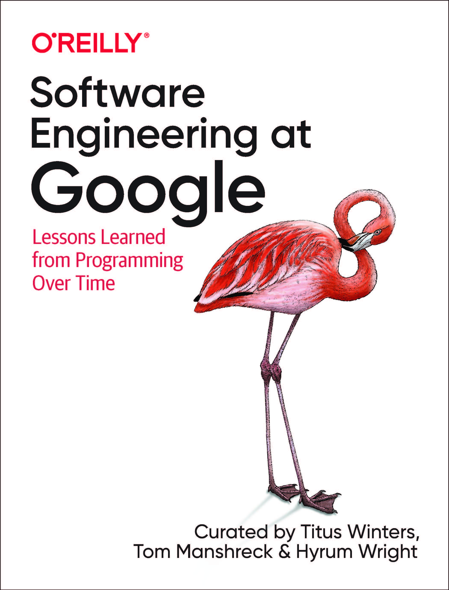
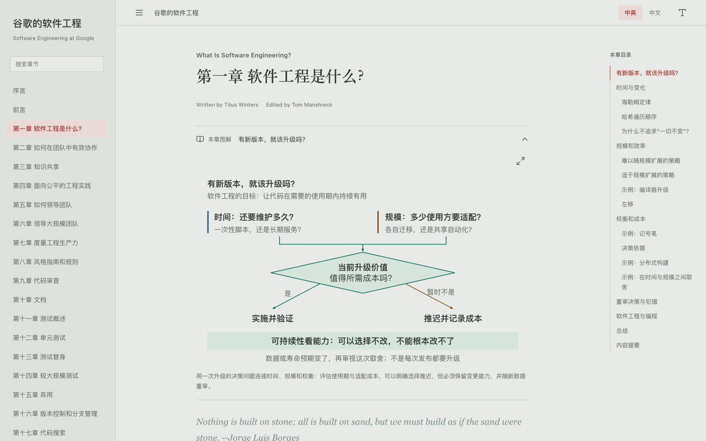
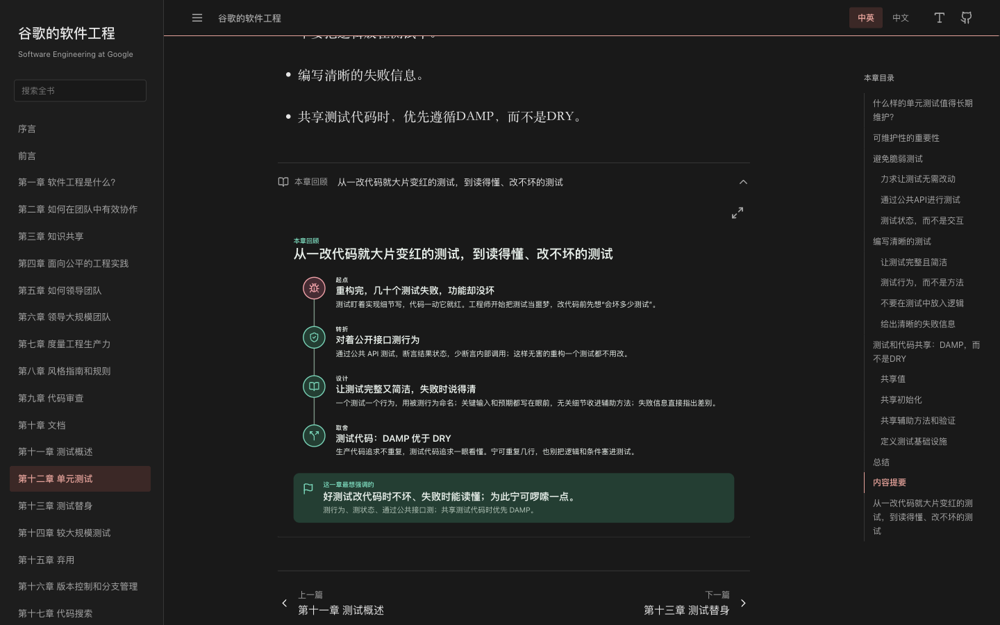

<div align="center">



# 谷歌的软件工程

**《Software Engineering at Google》中英对照阅读版**

在浏览器里逐段对照原文和译文，配有 134 张章节图解、就地展开的脚注和译者注。

[](https://dayuanjiang.github.io/Software-Engineering-at-Google/)
[](#章节导览)
[](#来源与许可)
[](https://github.com/DayuanJiang/Software-Engineering-at-Google/actions/workflows/ci.yml)

<br>

<a href="https://dayuanjiang.github.io/Software-Engineering-at-Google/">
  
</a>

</div>

<br>

## 这是什么

Google 用二十多年时间，把几万名工程师和几十亿行代码组织成一个能持续演进的整体。《Software Engineering at Google》记录了他们在这个过程中学到的东西：软件工程与编程的区别在哪里，代码审查为什么必须强制执行，测试为什么要按规模分级，依赖管理为什么远比想象中困难，以及大规模变更、持续集成和持续交付在 Google 内部到底是怎么运转的。

这个仓库把全书 25 章加序言、前言、后记做成了中英对照版本，并为它写了一个专门的阅读器。中文译文经过逐章审校和术语统一，审校记录完整保留在仓库里。

<div align="center">

| 中文译文 | 英文原文 | 章节图解 | 脚注与译者注 |
| :---: | :---: | :---: | :---: |
| 约 30 万字 | 约 22 万词 | 160 张 | 263 条 |

</div>

## 特色

- **逐段对照。** 每段英文原文下面紧跟中文译文。想练英文就开中英模式，想快速通读就切到纯中文，一个按钮切换。
- **每章都有图解。** 25 章各配章首的“本章概览”和章末的“本章回顾”：概览用一张地图讲这章有哪几块、怎么关联，回顾用一条故事线重讲这章想强调什么；110 个关键小节另有细节图。全部是 SVG 矢量图，由脚本从每章的内容数据生成，桌面和手机各有一套版式，可放大、可下载。
- **脚注就地展开。** 全书 252 条脚注和 11 条译者注以弹窗形式呈现，点开即读，关上回到原处，阅读节奏不被打断。
- **代码示例可切换为 Python。** 原书示例以 Java 为主，另有少量 C++ 和 Go。每个示例右上角有“Java | Python”标签，点一下就切换全书示例的语言。63 个示例中的 58 个有等价的 Python 改写并带语法高亮，其余 5 个没有对应写法，Python 标签置灰，悬停可见原因。
- **术语前后一致。** 核心术语经过人工审定，译法、适用范围和例外都记录在术语表里，全书统一。
- **读起来舒服。** 浅色与深色主题，正文字号 16 至 22 像素可调，右侧固定本章目录并随滚动高亮，顶部有阅读进度条。偏好设置保存在浏览器里。
- **轻快。** 首次打开只加载当前章节，全书搜索索引在第一次搜索时才下载。所有前端依赖都已本地化，没有远程字体，克隆下来用任何静态服务器都能跑。

## 开始阅读

在线版本：<https://dayuanjiang.github.io/Software-Engineering-at-Google/>

本地运行：

```bash
git clone https://github.com/DayuanJiang/Software-Engineering-at-Google.git
cd Software-Engineering-at-Google
python3 -m http.server 8000
# 打开 http://localhost:8000
```

如果只想读文字，[`zh-cn/`](zh-cn/) 目录下的 Markdown 在 GitHub 上直接点开就能看。

## 阅读器一览

<table>
  <tr>
    <td align="center"><br><sub>浅色主题，中英对照，章首的本章概览</sub></td>
    <td align="center"><br><sub>深色主题，章末的本章回顾：故事线与最想强调的主张</sub></td>
  </tr>
</table>

| 位置 | 功能 |
| --- | --- |
| 顶栏 | 中英 / 中文切换，阅读设置（主题、字号、代码示例语言），GitHub 仓库链接 |
| 左栏 | 全书搜索，章节列表 |
| 右栏 | 本章目录，随滚动高亮当前小节 |
| 章首 | 本章概览，默认展开，可收起，支持放大、适应窗口、下载 SVG |
| 正文 | 小节图解内嵌显示，脚注和译者注点击弹出，代码示例右上角的标签切换原文或 Python 改写 |
| 章末 | 本章回顾（故事线与最想强调的主张），上一章 / 下一章 |

## 章节导览

| 部分 | 章节 |
| --- | --- |
| 开篇 | [序言](zh-cn/Foreword.md) · [前言](zh-cn/Preface.md) |
| 第一部分 理论 | [1 软件工程是什么？](zh-cn/Chapter-1_What_Is_Software_Engineering/Chapter-1_What_Is_Software_Engineering.md) |
| 第二部分 文化 | [2 如何在团队中有效协作](zh-cn/Chapter-2_How_to_Work_Well_on_Teams/Chapter-2_How_to_Work_Well_on_Teams.md) · [3 知识共享](zh-cn/Chapter-3_Knowledge_Sharing/Chapter-3_Knowledge_Sharing.md) · [4 面向公平的工程实践](zh-cn/Chapter-4_Engineering_for_Equity/Chapter-4_Engineering_for_Equity.md) · [5 如何领导团队](zh-cn/Chapter-5_How_to_Lead_a_Team/Chapter-5_How_to_Lead_a_Team.md) · [6 领导大规模团队](zh-cn/Chapter-6_Leading_at_Scale/Chapter-6_Leading_at_Scale.md) · [7 度量工程生产力](zh-cn/Chapter-7_Measuring_Engineering_Productivity/Chapter-7_Measuring_Engineering_Productivity.md) |
| 第三部分 流程 | [8 风格指南和规则](zh-cn/Chapter-8_Style_Guides_and_Rules/Chapter-8_Style_Guides_and_Rules.md) · [9 代码审查](zh-cn/Chapter-9_Code_Review/Chapter-9_Code_Review.md) · [10 文档](zh-cn/Chapter-10_Documentation/Chapter-10_Documentation.md) · [11 测试概述](zh-cn/Chapter-11_Testing_Overview/Chapter-11_Testing_Overview.md) · [12 单元测试](zh-cn/Chapter-12_Unit_Testing/Chapter-12_Unit_Testing.md) · [13 测试替身](zh-cn/Chapter-13_Test_Doubles/Chapter-13_Test_Doubles.md) · [14 较大规模测试](zh-cn/Chapter-14_Larger_Testing/Chapter-14_Larger_Testing.md) · [15 弃用](zh-cn/Chapter-15_Deprecation/Chapter-15_Deprecation.md) |
| 第四部分 工具 | [16 版本控制和分支管理](zh-cn/Chapter-16_Version_Control_and_Branch_Management/Chapter-16_Version_Control_and_Branch_Management.md) · [17 代码搜索](zh-cn/Chapter-17_Code_Search/Chapter-17_Code_Search.md) · [18 构建系统与构建理念](zh-cn/Chapter-18_Build_Systems_and_Build_Philosophy/Chapter-18_Build_Systems_and_Build_Philosophy.md) · [19 Critique：谷歌的代码审查工具](zh-cn/Chapter-19_Critique_Googles_Code_Review_Tool/Chapter-19_Critique_Googles_Code_Review_Tool.md) · [20 静态分析](zh-cn/Chapter-20_Static_Analysis/Chapter-20_Static_Analysis.md) · [21 依赖管理](zh-cn/Chapter-21_Dependency_Management/Chapter-21_Dependency_Management.md) · [22 大规模变更](zh-cn/Chapter-22_Large-Scale_Changes/Chapter-22_Large-Scale_Changes.md) · [23 持续集成](zh-cn/Chapter-23_Continuous_Integration/Chapter-23_Continuous_Integration.md) · [24 持续交付](zh-cn/Chapter-24_Continuous_Delivery/Chapter-24_Continuous_Delivery.md) · [25 计算即服务](zh-cn/Chapter-25_Compute_as_a_Service/Chapter-25_Compute_as_a_Service.md) |
| 结语 | [后记](zh-cn/Afterword.md) |

## 仓库结构

```text
zh-cn/                       中英对照正文，每章一个目录
assets/reader.js             阅读器本体，以 Docsify 插件形式实现
assets/reader.css            阅读器样式，含浅色与深色主题
assets/reader-manifest.json  章节与图解清单，打开页面时加载
assets/reader-review/        每章编译后的脚注、译者注和显示修订，进入该章时加载
assets/search-index.json     全书搜索索引，第一次搜索时加载
assets/reader-content/       脚注与译者注的审校源数据
assets/code-variants/        代码示例的 Python 改写：每章一个目录，原文与改写成对存放，编译为按章 JSON
assets/diagrams/             160 张图解的 SVG 与元数据；章首概览和章末回顾由 chNN.json 里的内容生成
assets/vendor/               本地化的 Docsify 与图标依赖
tools/                       审校、校验和构建脚本，用 uv 管理
translation-review/          全书润色的审校记录、术语表与验收数据
.github/workflows/ci.yml     每次推送运行测试，并检查生成文件是否同步
```

## 翻译是怎么审校的

这是一本偏硬的技术书，润色以准确为先，改动幅度控制得很小。流程分三步：先用 spaCy 和 jieba 从全书抽取中英术语候选并统计共现，再由人工挑选、审定译法并写入术语表，最后逐章应用修改，并与原始快照比对确认英文、代码和图片一字未动。

想复核任何一处改动，可以从这几个文件进入：

- [术语表](translation-review/glossary.md)：每个核心术语的译法、范围、例外和原文依据。
- [全书审校入口](translation-review/book-summary.md)：28 篇文档的逐章记录。
- [交叉复核](translation-review/cross-review.md)：第十一至十四章的独立语义复核。
- [最终验收](translation-review/final-verification.md)：测试结果与未覆盖事项。
- [方法说明](translation-review/README.md)：抽取、配对和统计的完整规则。

## 参与改进

发现译文可以更好，欢迎直接提 Pull Request。

1. 修改 `zh-cn/` 下对应章节的中文段落，英文原文保持原样。
2. 涉及术语时先查[术语表](translation-review/glossary.md)，与已审定译法保持一致。
3. 改写代码示例时，在 `assets/code-variants/<章节>/` 下放一对文件：`NN.java`（或 `.cpp`、`.go`）保存原书代码，`NN.py` 保存 Python 改写；没有对应写法的示例改放 `NN.skip`，写明原因。构建脚本会检查原文能在章节中找到、Python 能通过语法解析。
4. 提交前在 `tools/` 目录跑一遍测试：

```bash
cd tools
uv sync
uv run --with pytest pytest -q
```

改动正文、图解或译者注后，重新生成章首和章末图、阅读器清单和搜索索引。CI 会检查这些生成文件是否与源文件同步。

```bash
uv run python build_chapter_figures.py
uv run python build_reader_manifest.py
uv run python build_search_index.py
```

## 来源与许可

中文译文源自 [qiangmzsx/Software-Engineering-at-Google](https://github.com/qiangmzsx/Software-Engineering-at-Google)，由 @qiangmzsx 及 @FingerLiu、@ll13、@jixiuf、@transfercai、@yangjun 等贡献者完成初译。本仓库在此基础上做了全书审校、术语统一，并新增了阅读器、图解和审校工具。

英文原著 *Software Engineering at Google* 由 Titus Winters、Tom Manshreck、Hyrum Wright 编著，O'Reilly 出版，原版 HTML 在 [abseil.io](https://abseil.io/resources/swe-book) 免费公开。国内已有正式出版的中文版《Google 软件工程》，推荐购买支持作者与译者。

书籍内容采用 [CC BY-SA 3.0](https://creativecommons.org/licenses/by-sa/3.0/) 授权，代码采用 [BSD 3-Clause](https://opensource.org/licenses/BSD-3-Clause) 许可，详见 [LICENSE](LICENSE)。阅读器使用的 [Docsify](https://docsify.js.org/) 与 [Lucide](https://lucide.dev/) 的许可见 [`assets/vendor/`](assets/vendor/)。
