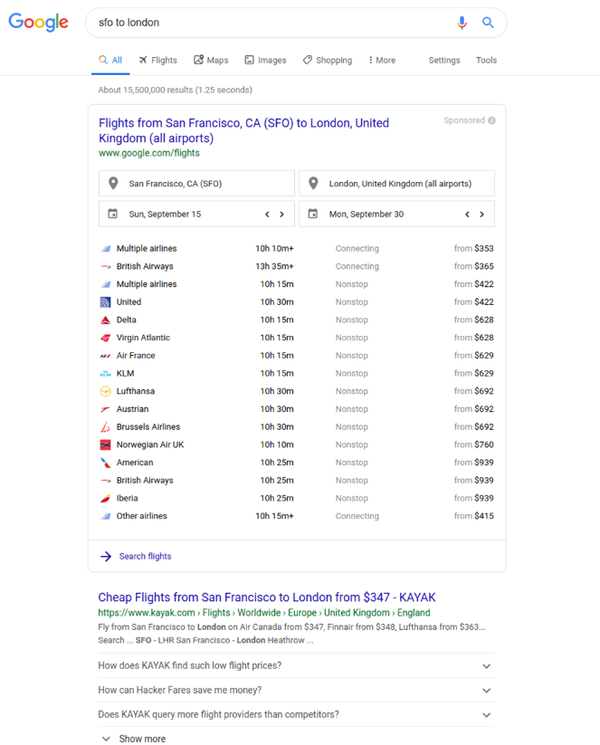
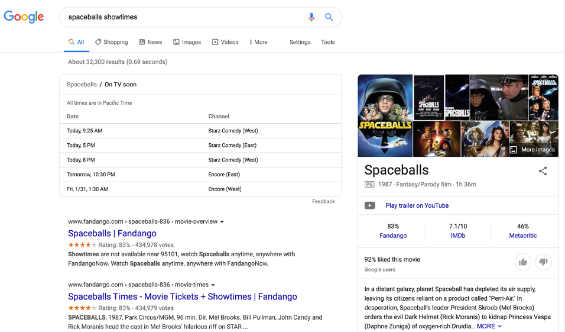
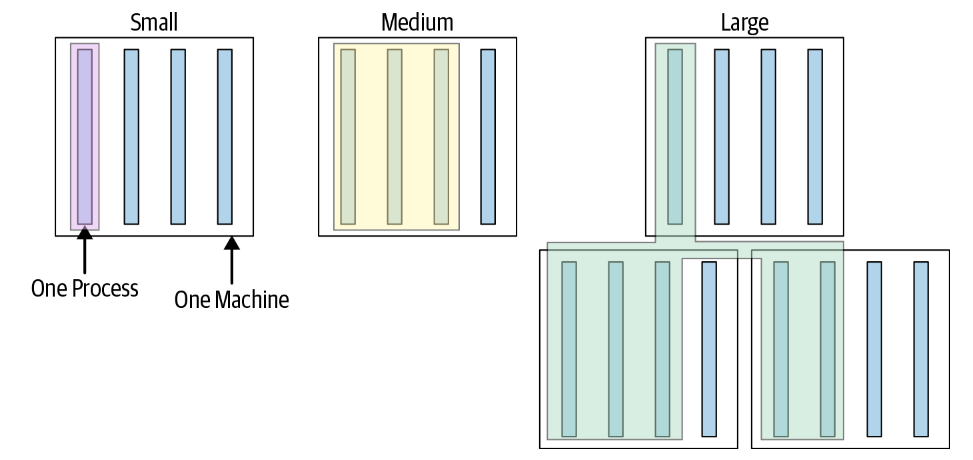
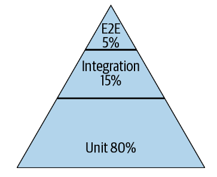
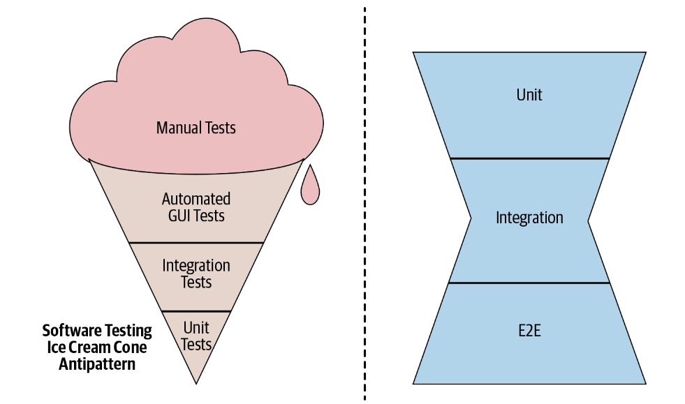

**CHAPTER 11**

# Testing Overview

# 第十一章 测试概述

**Written by Adam Bender**

**Edited by Tom Manshreck**

Testing has always been a part of programming. In fact, the first time you wrote a computer program you almost certainly threw some sample data at it to see whether it performed as you expected. For a long time, the state of the art in software testing resembled a very similar process, largely manual and error prone. However, since the early 2000s, the software industry’s approach to testing has evolved dramatically to cope with the size and complexity of modern software systems. Central to that evolution has been the practice of developer-driven, automated testing.

测试一直是编程的一部分。事实上，第一次编写计算机程序时，你几乎肯定会输入一些样例数据，看看程序是否按预期运行。在很长一段时间里，即使最先进的软件测试方法也与这个过程相差无几，主要依靠手工操作，而且容易出错。不过，自21世纪初以来，为了应对现代软件系统的规模和复杂性，软件行业的测试方法发生了巨大变化。由开发者驱动的自动化测试实践，正是这场演进的核心。

Automated testing can prevent bugs from escaping into the wild and affecting your users. The later in the development cycle a bug is caught, the more expensive it is; exponentially so in many cases.[^1] However, “catching bugs” is only part of the motivation. An equally important reason why you want to test your software is to support the ability to change. Whether you’re adding new features, doing a refactoring focused on code health, or undertaking a larger redesign, automated testing can quickly catch mistakes, and this makes it possible to change software with confidence.

自动化测试可以防止缺陷进入实际使用环境并影响用户。在开发周期中，缺陷发现得越晚，修复成本就越高；许多情况下，成本甚至会呈指数增长。不过，“发现缺陷”只是测试动机的一部分。测试软件还有一个同样重要的理由：让软件能够持续变更。无论是添加新功能、为改善代码健康状况而重构，还是进行更大规模的重新设计，自动化测试都能迅速发现错误，让你有信心修改软件。

Companies that can iterate faster can adapt more rapidly to changing technologies, market conditions, and customer tastes. If you have a robust testing practice, you needn’t fear change—you can embrace it as an essential quality of developing software. The more and faster you want to change your systems, the more you need a fast way to test them.

迭代更快的公司，也能更快地适应技术、市场环境和客户偏好的变化。有了扎实的测试实践，就不必害怕变更，而可以将其视为软件开发不可或缺的一部分。你希望对系统作出的变更越多、越快，就越需要快速测试系统的方法。

The act of writing tests also improves the design of your systems. As the first clients of your code, a test can tell you much about your design choices. Is your system too tightly coupled to a database? Does the API support the required use cases? Does your system handle all of the edge cases? Writing automated tests forces you to confront these issues early on in the development cycle. Doing so generally leads to more modular software that enables greater flexibility later on.

编写测试也能改善系统设计。测试是代码的第一批使用者，能帮助你看清许多设计选择是否合适：系统与数据库的耦合是否过于紧密？API 是否支持所需的用例？系统是否处理了所有边界情况？编写自动化测试会促使你在开发周期早期就面对这些问题，通常也会让软件更加模块化，为后续变更留下更大的灵活性。

Much ink has been spilled about the subject of testing software, and for good reason: for such an important practice, doing it well still seems to be a mysterious craft to many. At Google, while we have come a long way, we still face difficult problems getting our processes to scale reliably across the company. In this chapter, we’ll share what we have learned to help further the conversation.

关于软件测试的论述已经很多，原因也很充分：测试如此重要，但在许多人看来，如何做好测试仍像是一门神秘的技艺。谷歌虽然已经取得长足进步，但要让测试流程可靠地扩展到全公司，仍有难题需要解决。本章将分享我们的经验，希望推动这一话题的进一步讨论。

> [^1]: See “Defect Prevention: Reducing Costs and Enhancing Quality.”
>
> 1  参见《缺陷预防：降低成本和提高质量》。

## Why Do We Write Tests?  为什么我们要编写测试？

To better understand how to get the most out of testing, let’s start from the beginning. When we talk about automated testing, what are we really talking about?

要理解如何充分发挥测试的价值，不妨先从最基本的问题说起：我们谈论自动化测试时，究竟在谈什么？

The simplest test is defined by:

- A single behavior you are testing, usually a method or API that you are calling
- A specific input, some value that you pass to the API
- An observable output or behavior
- A controlled environment such as a single isolated process

最简单的测试由以下要素定义：

- 要测试的单一行为，通常是调用某个方法或 API
- 特定的输入，即传给 API 的某个值
- 可观察的输出或行为
- 受控的环境，例如一个独立、隔离的进程

When you execute a test like this, passing the input to the system and verifying the output, you will learn whether the system behaves as you expect. Taken in aggregate, hundreds or thousands of simple tests (usually called a *test suite*) can tell you how well your entire product conforms to its intended design and, more important, when it doesn’t.

运行这样的测试，也就是向系统提供输入并验证输出，就能知道系统的行为是否符合预期。将成百上千个简单测试汇集起来，通常就称为一个*测试套件*。它能告诉你整个产品在多大程度上符合预期设计，更重要的是，能指出何时不符合。

Creating and maintaining a healthy test suite takes real effort. As a codebase grows, so too will the test suite. It will begin to face challenges like instability and slowness. A failure to address these problems will cripple a test suite. Keep in mind that tests derive their value from the trust engineers place in them. If testing becomes a productivity sink, constantly inducing toil and uncertainty, engineers will lose trust and begin to find workarounds. A bad test suite can be worse than no test suite at all.

创建并维护健康的测试套件，需要切实投入精力。代码库增长，测试套件也会随之增长，并逐渐面临结果不稳定、运行缓慢等挑战。如果不解决这些问题，测试套件就会难以发挥作用。要记住，测试的价值建立在工程师对它的信任之上。如果测试不断消耗生产力，带来琐务和不确定性，工程师就会失去信任，开始设法绕过测试。糟糕的测试套件，可能还不如没有。

In addition to empowering companies to build great products quickly, testing is becoming critical to ensuring the safety of important products and services in our lives. Software is more involved in our lives than ever before, and defects can cause  more than a little annoyance: they can cost massive amounts of money, loss of property, or, worst of all, loss of life.[^2]

测试不仅能帮助公司快速构建优秀产品，也日益成为保障生活中重要产品和服务安全的关键。软件与生活的联系比以往更加紧密，缺陷带来的可能不只是小麻烦，还可能是巨额经济损失、财产损失，甚至最严重的后果：夺去人的生命。

At Google, we have determined that testing cannot be an afterthought. Focusing on quality and testing is part of how we do our jobs. We have learned, sometimes painfully, that failing to build quality into our products and services inevitably leads to bad outcomes. As a result, we have built testing into the heart of our engineering culture.

在谷歌，我们已经认识到，不能等到事后才考虑测试。重视质量和测试，本就是工作的一部分。经验，有时是惨痛的教训，让我们明白：如果不在构建产品和服务的过程中保证质量，最终必然会付出代价。因此，我们将测试置于工程文化的核心。

> [^2]: See “Failure at Dhahran.”
>
> 2   参见《达兰的故障》。

### The Story of Google Web Server  谷歌 Web 服务器的故事

In Google’s early days, engineer-driven testing was often assumed to be of little importance. Teams regularly relied on smart people to get the software right. A few systems ran large integration tests, but mostly it was the Wild West. One product in particular seemed to suffer the worst: it was called the Google Web Server, also known as GWS.

谷歌早期往往不太重视由工程师驱动的测试。团队通常依靠聪明能干的工程师把软件写对。少数系统会运行大型集成测试，但大多数项目仍缺乏规范。其中，受影响似乎最严重的一个产品是谷歌 Web 服务器，也就是 GWS。

GWS is the web server responsible for serving Google Search queries and is as important to Google Search as air traffic control is to an airport. Back in 2005, as the project swelled in size and complexity, productivity had slowed dramatically. Releases were becoming buggier, and it was taking longer and longer to push them out. Team members had little confidence when making changes to the service, and often found out something was wrong only when features stopped working in production. (At one point, more than 80% of production pushes contained user-affecting bugs that had to be rolled back.)

GWS 是处理谷歌搜索查询的 Web 服务器，对谷歌搜索的重要性，就像空中交通管制对机场一样。2005年，随着项目规模扩大、复杂性增加，开发效率大幅下降。发布版本中的缺陷越来越多，发布所需的时间也越来越长。团队成员对修改服务缺乏信心，往往直到生产环境中的功能失效，才知道出了问题。（有一段时间，超过80%的生产发布都含有影响用户的缺陷，不得不回滚。）

To address these problems, the tech lead (TL) of GWS decided to institute a policy of engineer-driven, automated testing. As part of this policy, all new code changes were required to include tests, and those tests would be run continuously. Within a year of instituting this policy, the number of emergency pushes *dropped by half*. This drop occurred despite the fact that the project was seeing a record number of new changes every quarter. Even in the face of unprecedented growth and change, testing brought renewed productivity and confidence to one of the most critical projects at Google. Today, GWS has tens of thousands of tests, and releases almost every day with relatively few customer-visible failures.

为了解决这些问题，GWS 的技术负责人（TL）决定推行由工程师驱动的自动化测试，要求所有新代码变更都附带测试，并持续运行这些测试。实施这项策略后的一年内，紧急发布次数就*下降了一半*，而同期项目每个季度的新增变更数量都在创纪录。即使面临前所未有的增长和变更，测试仍让这个谷歌最关键的项目之一重新找回了生产力和信心。如今，GWS 拥有数万个测试，几乎每天发布，用户可见的故障却相对较少。

The changes in GWS marked a watershed for testing culture at Google as teams in other parts of the company saw the benefits of testing and moved to adopt similar tactics.

GWS 的转变成为谷歌测试文化的分水岭。公司其他部门的团队看到测试带来的好处，也开始采用类似做法。

One of the key insights the GWS experience taught us was that you can’t rely on programmer ability alone to avoid product defects. Even if each engineer writes only the occasional bug, after you have enough people working on the same project, you will be swamped by the ever-growing list of defects. Imagine a hypothetical 100-person team whose engineers are so good that they each write only a single bug a month. Collectively, this group of amazing engineers still produces five new bugs every workday. Worse yet, in a complex system, fixing one bug can often cause another, as engineers adapt to known bugs and code around them.

GWS 的经历给了我们一个重要启示：不能只靠程序员的能力来避免产品缺陷。即使每位工程师只是偶尔引入缺陷，只要共同参与项目的人足够多，不断增长的缺陷清单仍会让团队不堪重负。假设一个团队有100人，每位工程师都很优秀，每月只引入一个缺陷。即便如此，这个出色的团队每个工作日仍会产生5个新缺陷。更糟的是，在复杂系统中，工程师可能已经编写代码来适应或绕过已知缺陷，因此修复一个缺陷往往又会引发另一个。

The best teams find ways to turn the collective wisdom of its members into a benefit for the entire team. That is exactly what automated testing does. After an engineer on the team writes a test, it is added to the pool of common resources available to others. Everyone else on the team can now run the test and will benefit when it detects an issue. Contrast this with an approach based on debugging, wherein each time a bug occurs, an engineer must pay the cost of digging into it with a debugger. The cost in engineering resources is night and day and was the fundamental reason GWS was able to turn its fortunes around.

优秀的团队会设法让成员的集体智慧惠及整个团队，自动化测试正能做到这一点。一位工程师写好测试后，就把它加入所有人都能使用的公共资源。团队其他成员都可以运行这个测试，并在它发现问题时受益。相比之下，如果主要依靠调试，每次出现缺陷，都得有工程师花时间用调试器深入排查。两种做法消耗的工程资源相差悬殊，这正是 GWS 能够扭转局面的根本原因。

### Testing at the Speed of Modern Development  让测试跟上现代开发的速度

Software systems are growing larger and ever more complex. A typical application or service at Google is made up of thousands or millions of lines of code. It uses hundreds of libraries or frameworks and must be delivered via unreliable networks to an increasing number of platforms running with an uncountable number of configurations. To make matters worse, new versions are pushed to users frequently, sometimes multiple times each day. This is a far cry from the world of shrink-wrapped software that saw updates only once or twice a year.

软件系统的规模和复杂性都在不断增加。谷歌一个典型的应用或服务，可能包含数千行乃至数百万行代码，使用数百个库或框架，还必须通过不可靠的网络交付到越来越多的平台上，在不计其数的配置下运行。更棘手的是，新版本会频繁推送给用户，有时一天就有多次。这与盒装软件每年只更新一两次的时代，已经大不相同。

The ability for humans to manually validate every behavior in a system has been unable to keep pace with the explosion of features and platforms in most software. Imagine what it would take to manually test all of the functionality of Google Search, like finding flights, movie times, relevant images, and of course web search results (see Figure 11-1). Even if you can determine how to solve that problem, you then need to multiply that workload by every language, country, and device Google Search must support, and don’t forget to check for things like accessibility and security. Attempting to assess product quality by asking humans to manually interact with every feature just doesn’t scale. When it comes to testing, there is one clear answer: automation.

大多数软件的功能和支持平台都在迅速增加，人工逐一验证系统行为的方式已经跟不上了。想象一下，要手工测试谷歌搜索的所有功能，包括查询航班、电影场次、相关图片，当然还有网页搜索结果，需要付出多少工作（见图11-1）。即使解决了这个问题，还得把工作量乘以谷歌搜索需要支持的每一种语言、国家和设备组合，并且不能漏掉无障碍访问、安全性等检查。靠人工逐一操作所有功能来评估产品质量，无法随规模增长而扩展。对于测试，答案很明确：自动化。





*Figure 11-1. Screenshots of two complex Google search results*  *图11-1：两个复杂的谷歌搜索结果页面截图*

### Write, Run, React  编写、运行、处理失败

In its purest form, automating testing consists of three activities: writing tests, running tests, and reacting to test failures. An automated test is a small bit of code, usually a single function or method, that calls into an isolated part of a larger system that you want to test. The test code sets up an expected environment, calls into the system, usually with a known input, and verifies the result. Some of the tests are very small, exercising a single code path; others are much larger and can involve entire systems, like a mobile operating system or web browser.

自动化测试最基本的形式包含三项活动：编写测试、运行测试、处理测试失败。一个自动化测试就是一小段代码，通常是单个函数或方法，用来调用待测系统中隔离出来的一部分。测试代码先准备好预期环境，再调用系统，通常会提供已知输入，最后验证结果。有些测试很小，只执行一条代码路径；有些则大得多，可能涉及整个系统，例如移动操作系统或 Web 浏览器。

Example 11-1 )presents a deliberately simple test in Java using no frameworks or testing libraries. This is not how you would write an entire test suite, but at its core every automated test looks similar to this very simple example.

例11-1是一个刻意简化的 Java 测试，没有使用任何框架或测试库。你不会用这种方式编写整个测试套件，但就核心原理而言，每个自动化测试都与这个简单示例类似。

*Example 11-1. An example test*  *例11-1：一个测试示例*

```java
// Verifies a Calculator class can handle negative results.
public void main(String[] args) {
	Calculator calculator = new Calculator();
	int expectedResult = -3;
	int actualResult = calculator.subtract(2, 5); // Given 2, Subtracts 5.
	assert(expectedResult == actualResult);
}
```

Unlike the QA processes of yore, in which rooms of dedicated software testers pored over new versions of a system, exercising every possible behavior, the engineers who build systems today play an active and integral role in writing and running automated tests for their own code. Even in companies where QA is a prominent organization, developer-written tests are commonplace. At the speed and scale that today’s systems are being developed, the only way to keep up is by sharing the development of tests around the entire engineering staff.

过去的质量保证（QA）流程，通常是一屋子的专职软件测试人员仔细检查系统新版本，尝试各种可能的行为。如今，构建系统的工程师会主动为自己的代码编写并运行自动化测试，成为测试工作不可或缺的一环。即使在 QA 部门地位重要的公司，由开发者编写测试也很常见。要跟上当今系统开发的速度和规模，唯一的办法就是让全体工程师共同承担测试开发工作。

Of course, writing tests is different from writing *good tests*. It can be quite difficult to train tens of thousands of engineers to write good tests. We will discuss what we have learned about writing good tests in the chapters that follow.

当然，编写测试与编写*好测试*并不是一回事。要让数万名工程师学会写好测试，相当不易。后续章节将介绍我们在这方面积累的经验。

Writing tests is only the first step in the process of automated testing. After you have written tests, you need to run them. Frequently. At its core, automated testing consists of repeating the same action over and over, only requiring human attention when something breaks. We will discuss this Continuous Integration (CI) and testing in Chapter 23. By expressing tests as code instead of a manual series of steps, we can run them every time the code changes—easily thousands of times per day. Unlike human testers, machines never grow tired or bored.

编写测试只是自动化测试的第一步。写好之后，还需要运行，而且要频繁运行。自动化测试的核心，就是反复执行相同的操作，只在出现问题时才需要人工介入。第23章将讨论这种持续集成（CI）与测试。把测试写成代码，而不是一系列手工操作步骤，就能在每次代码变更时运行测试，每天运行数千次也不难。与人工测试人员不同，机器不会疲劳，也不会厌倦。

Another benefit of having tests expressed as code is that it is easy to modularize them for execution in various environments. Testing the behavior of Gmail in Firefox requires no more effort than doing so in Chrome, provided you have configurations for both of these systems.^3 Running tests for a user interface (UI) in Japanese or German can be done using the same test code as for English.

用代码表达测试的另一个好处，是容易将测试模块化，以便在不同环境中运行。只要备好两种浏览器的配置，在 Firefox 中测试 Gmail 的行为，并不比在 Chrome 中更费力。测试日语或德语用户界面（UI），也可以使用与英语界面相同的测试代码。

Products and services under active development will inevitably experience test failures. What really makes a testing process effective is how it addresses test failures. Allowing failing tests to pile up quickly defeats any value they were providing, so it is imperative not to let that happen. Teams that prioritize fixing a broken test within minutes of a failure are able to keep confidence high and failure isolation fast, and therefore derive more value out of their tests.

持续开发中的产品和服务，难免会出现测试失败。测试流程能否发挥作用，关键在于如何处理失败。任由失败的测试积压，测试原有的价值很快就会丧失，因此必须避免这种情况。把修复失败测试放在优先位置、争取在失败后几分钟内解决问题的团队，能够保持对测试的信心，迅速定位故障，从而获得更多测试收益。

In summary, a healthy automated testing culture encourages everyone to share the work of writing tests. Such a culture also ensures that tests are run regularly. Last, and perhaps most important, it places an emphasis on fixing broken tests quickly so as to maintain high confidence in the process.

总之，健康的自动化测试文化鼓励所有人共同承担编写测试的工作，也确保测试定期运行。最后，也许最重要的一点，是强调迅速修复失败的测试，让大家持续信任测试流程。

> [^3]: Getting the behavior right across different browsers and languages is a different story! But, ideally, the end- user experience should be the same for everyone.
>
> 3 要让软件在不同浏览器和语言环境中都表现正确，则是另一回事！不过，理想情况下，所有终端用户都应该获得一致的体验。

### Benefits of Testing Code  测试代码的好处

To developers coming from organizations that don’t have a strong testing culture, the idea of writing tests as a means of improving productivity and velocity might seem antithetical. After all, the act of writing tests can take just as long (if not longer!) than implementing a feature would take in the first place. On the contrary, at Google, we’ve found that investing in software tests provides several key benefits to developer productivity:

- *Less debugging*  
	As you would expect, tested code has fewer defects when it is submitted. Critically, it also has fewer defects throughout its existence; most of them will be caught before the code is submitted. A piece of code at Google is expected to be modified dozens of times in its lifetime. It will be changed by other teams and even automated code maintenance systems. A test written once continues to pay dividends and prevent costly defects and annoying debugging sessions through the lifetime of the project. Changes to a project, or the dependencies of a project, that break a test can be quickly detected by test infrastructure and rolled back before the problem is ever released to production.

- *Increased* *confidence* *in* *changes*  
	All software changes. Teams with good tests can review and accept changes to their project with confidence because all important behaviors of their project are continuously verified. Such projects encourage refactoring. Changes that refactor code while preserving existing behavior should (ideally) require no changes to existing tests.

- *Improved* *documentation*  
	Software documentation is notoriously unreliable. From outdated requirements to missing edge cases, it is common for documentation to have a tenuous relationship to the code. Clear, focused tests that exercise one behavior at a time function as executable documentation. If you want to know what the code does in a particular case, look at the test for that case. Even better, when requirements change and new code breaks an existing test, we get a clear signal that the “documentation” is now out of date. Note that tests work best as documentation only if care is taken to keep them clear and concise.

- *Simpler* *reviews*  
	All code at Google is reviewed by at least one other engineer before it can be submitted (see [Chapter 9 ](#_bookmark664)for more details). A code reviewer spends less effort verifying code works as expected if the code review includes thorough tests that demonstrate code correctness, edge cases, and error conditions. Instead of the tedious effort needed to mentally walk each case through the code, the reviewer can verify that each case has a passing test.

- *Thoughtful* *design*  
	Writing tests for new code is a practical means of exercising the API design of the code itself. If new code is difficult to test, it is often because the code being tested has too many responsibilities or difficult-to-manage dependencies. Well- designed code should be modular, avoiding tight coupling and focusing on specific responsibilities. Fixing design issues early often means less rework later.

- *Fast, high-quality releases*  
	With a healthy automated test suite, teams can release new versions of their application with confidence. Many projects at Google release a new version to production every day—even large projects with hundreds of engineers and thousands of code changes submitted every day. This would not be possible without automated testing.

如果开发者原先所在的组织缺乏扎实的测试文化，那么“编写测试能提高生产力、加快开发速度”听起来可能自相矛盾。毕竟，写测试花费的时间可能与实现功能一样长，甚至更长！但在谷歌，我们发现，投入软件测试能从几个关键方面提高开发者的生产力：

- *更少的调试*  
	不难想象，经过测试的代码在提交时缺陷更少。更重要的是，在整个生命周期中，它的缺陷也更少，因为大多数缺陷在代码提交前就会被发现。在谷歌，一段代码在其生命周期中预计会被修改数十次，修改者可能是其他团队，甚至是自动化代码维护系统。测试编写一次，就能在项目的整个生命周期中持续发挥作用，避免代价高昂的缺陷和令人烦恼的调试。如果项目本身或其依赖的变更导致测试失败，测试基础设施就能迅速发现，让这些变更在问题进入生产环境之前回滚。

- *增强对变更的信心*  
	所有软件都会变化。有了良好的测试，团队就能有信心地审查并接受项目变更，因为项目的所有重要行为都在持续得到验证。这样的项目也鼓励重构。理想情况下，只要重构保留了原有行为，就应该无须修改现有测试。

- *改进文档*  
	软件文档不可靠，是个常见问题。需求过时、边界情况遗漏，都可能让文档与代码对不上。清晰、专注于单一行为的测试，可以充当可执行的文档。想知道代码在某种情况下会做什么，就看对应的测试。更好的是，需求发生变化、新代码导致现有测试失败时，我们就会得到明确提示：“文档”已经过时。需要注意，只有用心保持测试清晰简洁，它们才能充分发挥文档的作用。

- *更轻松的审查*  
	在谷歌，所有代码提交前，都必须经过至少一名其他工程师的审查（详见第9章）。如果待审代码附有充分的测试，能展示代码的正确性以及对边界情况和错误情况的处理，审查者验证代码是否符合预期就会更省力。审查者只需确认每种情况都有对应且通过的测试，无须费力地在脑中逐一推演代码的执行过程。

- *更周全的设计*  
	为新代码编写测试，是检验其 API 设计的实用方法。如果新代码难以测试，往往是因为它承担了过多职责，或其依赖难以管理。设计良好的代码应该模块化、避免紧密耦合，并专注于明确的职责。尽早解决设计问题，通常就能减少后续返工。

- *快速、高质量的发布*  
	有了健康的自动化测试套件，团队就能有信心地发布应用的新版本。谷歌许多项目每天都会向生产环境发布新版本，即使是拥有数百名工程师、每天提交数千次代码变更的大型项目也不例外。没有自动化测试，这就不可能实现。

## Designing a Test Suite  设计测试套件

Today, Google operates at a massive scale, but we haven’t always been so large, and the foundations of our approach were laid long ago. Over the years, as our codebase has grown, we have learned a lot about how to approach the design and execution of a test suite, often by making mistakes and cleaning up afterward.

如今，谷歌的规模很大，但并非一直如此；我们的测试方法，早在很久以前就奠定了基础。多年来，随着代码库增长，我们积累了许多设计和运行测试套件的经验，其中不少来自犯错以及事后的补救。

One of the lessons we learned fairly early on is that engineers favored writing larger, system-scale tests, but that these tests were slower, less reliable, and more difficult to debug than smaller tests. Engineers, fed up with debugging the system-scale tests, asked themselves, “Why can’t we just test one server at a time?” or, “Why do we need to test a whole server at once? We could test smaller modules individually.” Eventually, the desire to reduce pain led teams to develop smaller and smaller tests, which turned out to be faster, more stable, and generally less painful.

我们很早就发现，工程师往往偏爱编写规模较大、覆盖整个系统的测试，但这类测试比小型测试更慢、更不可靠，也更难调试。受够了调试系统级测试的麻烦后，工程师开始问：“为什么不能一次只测试一个服务器？”或者：“为什么非要一次测试整个服务器？我们可以逐个测试较小的模块。”为了减轻这些负担，团队开始编写越来越小的测试，结果发现，它们更快、更稳定，通常也省心不少。

This led to a lot of discussion around the company about the exact meaning of “small.” Does small mean unit test? What about integration tests, what size are those? We have come to the conclusion that there are two distinct dimensions for every test case: size and scope. Size refers to the resources that are required to run a test case: things like memory, processes, and time. Scope refers to the specific code paths we are verifying. Note that executing a line of code is different from verifying that it worked as expected. Size and scope are interrelated but distinct concepts.

这引发了全公司对“小”究竟意味着什么的广泛讨论。小型测试就是单元测试吗？集成测试又属于哪种规模？我们最终认识到，每个测试用例都有两个不同的维度：规模和范围。规模指运行测试所需的资源，例如内存、进程和时间；范围指要验证的具体代码路径。需要注意，执行一行代码，并不等于验证它是否按预期工作。规模与范围彼此相关，但并不是同一个概念。

### Test Size  测试规模

At Google, we classify every one of our tests into a size and encourage engineers to always write the smallest possible test for a given piece of functionality. A test’s size is determined not by its number of lines of code, but by how it runs, what it is allowed to do, and how many resources it consumes. In fact, in some cases, our definitions of small, medium, and large are actually encoded as constraints the testing infrastructure can enforce on a test. We go into the details in a moment, but in brief, *small tests* run in a single process, *medium tests* run on a single machine, and *large tests* run wherever they want, as demonstrated in [Figure 11-2](#_bookmark872).[^4](#_bookmark873)

在谷歌，每个测试都会按规模分类。我们鼓励工程师针对给定功能，始终编写规模尽可能小的测试。测试规模不取决于代码行数，而取决于运行方式、允许执行的操作，以及消耗的资源。实际上，有些规模定义已经落实为测试基础设施能够强制执行的约束。稍后会详细说明，简而言之，*小型测试*在单个进程中运行，*中型测试*在单台机器上运行，而*大型测试*不受运行位置限制，如图11-2所示。



*Figure 11-2. Test sizes*  *Figure 11-2. 测试规模*

We make this distinction, as opposed to the more traditional “unit” or “integration,” because the most important qualities we want from our test suite are speed and determinism, regardless of the scope of the test. Small tests, regardless of the scope, are almost always faster and more deterministic than tests that involve more infrastructure or consume more resources. Placing restrictions on small tests makes speed and determinism much easier to achieve. As test sizes grow, many of the restrictions are relaxed. Medium tests have more flexibility but also more risk of nondeterminism. Larger tests are saved for only the most complex and difficult testing scenarios. Let’s take a closer look at the exact constraints imposed on each type of test.

我们采用这种划分，而不是传统的“单元测试”“集成测试”分类，是因为无论测试范围如何，我们最看重的都是测试套件的速度和确定性。小型测试不论范围宽窄，几乎总比涉及更多基础设施或消耗更多资源的测试更快、更具确定性。对小型测试施加约束，更容易保证这两点。随着测试规模增大，许多限制会放宽。中型测试更灵活，出现非确定性行为的风险也更高；大型测试则只用于最复杂、最难测试的场景。下面具体看看各类测试受到哪些约束。

> [^4]:	Technically, we have four sizes of test at Google: small, medium, large, and enormous. The internal difference between large and enormous is actually subtle and historical; so, in this book, most descriptions of large actually apply to our notion of enormous.
>
> 4 严格来说，谷歌有四种规模的测试：小型、中型、大型和超大型。在内部分类中，大型与超大型的区别其实很细微，也有历史原因。因此，本书对大型测试的多数描述，实际上对应谷歌内部的超大型测试。

#### Small tests  小型测试

Small tests are the most constrained of the three test sizes. The primary constraint is that small tests must run in a single process. In many languages, we restrict this even further to say that they must run on a single thread. This means that the code performing the test must run in the same process as the code being tested. You can’t run a server and have a separate test process connect to it. It also means that you can’t run a third-party program such as a database as part of your test.

在三种测试规模中，小型测试的约束最严格。首要约束是必须在单个进程中运行；对于许多语言，我们还进一步要求测试在单个线程中运行。这意味着，测试代码必须与被测代码处于同一进程。你不能启动一个服务器，再用独立的测试进程连接它，也不能在测试中启动数据库之类的第三方程序。

The other important constraints on small tests are that they aren’t allowed to sleep, perform I/O operations,[^5] or make any other blocking calls. This means that small tests aren’t allowed to access the network or disk. Testing code that relies on these sorts of operations requires the use of test doubles (see Chapter 13) to replace the heavyweight dependency with a lightweight, in-process dependency.

小型测试还有几项重要约束：不能休眠、执行 I/O 操作，或进行其他阻塞调用，也就是说，不能访问网络或磁盘。要测试依赖这类操作的代码，就需要使用测试替身（见第13章），以轻量级的进程内依赖替代重量级依赖。

The purpose of these restrictions is to ensure that small tests don’t have access to the main sources of test slowness or nondeterminism. A test that runs on a single process and never makes blocking calls can effectively run as fast as the CPU can handle. It’s difficult (but certainly not impossible) to accidentally make such a test slow or nondeterministic. The constraints on small tests provide a sandbox that prevents engineers from shooting themselves in the foot.

这些约束旨在让小型测试避开造成测试缓慢或非确定性的主要因素。在单个进程中运行、从不进行阻塞调用的测试，实际上可以按 CPU 所能处理的速度运行。要无意间把这样的测试写得缓慢或不具确定性，并不容易，但当然也不是不可能。小型测试的这些约束形成了一个沙箱，帮助工程师避免给自己制造麻烦。


These restrictions might seem excessive at first, but consider a modest suite of a couple hundred small test cases running throughout the day. If even a few of them fail nondeterministically (often called [flaky tests](https://oreil.ly/NxC4A)), tracking down the cause becomes a serious drain on productivity. At Google’s scale, such a problem could grind our testing infrastructure to a halt.

乍看之下，这些限制可能过于严格。但设想一个规模不大的测试套件，只有几百个小型测试用例，却会全天反复运行。哪怕只有少数测试会非确定性地失败（通常称为不稳定测试），排查原因也会消耗大量生产力。在谷歌这样的规模下，这类问题甚至可能让测试基础设施陷入停顿。

At Google, we encourage engineers to try to write small tests whenever possible, regardless of the scope of the test, because it keeps the entire test suite running fast and reliably. For more discussion on small versus unit tests, see Chapter 12.

在谷歌，无论测试范围如何，我们都鼓励工程师尽可能编写小型测试，因为这样能让整个测试套件快速、可靠地运行。关于小型测试与单元测试的进一步讨论，见第12章。

> [^5]: There is a little wiggle room in this policy. Tests are allowed to access a filesystem if they use a hermetic, in- memory implementation.
>
> 5 这项规则留有一点余地：如果文件系统使用的是与外部环境隔离的内存实现，测试就可以访问它。

#### Medium tests  中型测试

The constraints placed on small tests can be too restrictive for many interesting kinds of tests. The next rung up the ladder of test sizes is the medium test. Medium tests can span multiple processes, use threads, and can make blocking calls, including network calls, to localhost. The only remaining restriction is that medium tests aren’t allowed to make network calls to any system other than localhost. In other words, the test must be contained within a single machine.

对于许多有价值的测试，小型测试的约束可能过于严格。再大一级就是中型测试。中型测试可以跨多个进程、使用线程，也可以进行阻塞调用，包括访问本机的网络调用。唯一保留的限制是：不能通过网络调用 localhost 以外的系统。换句话说，整个测试必须在单台机器内完成。

The ability to run multiple processes opens up a lot of possibilities. For example, you could run a database instance to validate that the code you’re testing integrates correctly in a more realistic setting. Or you could test a combination of web UI and server code. Tests of web applications often involve tools like [WebDriver ](https://oreil.ly/W27Uf)that start a real browser and control it remotely via the test process.

能够运行多个进程，就有了更多测试方式。例如，可以启动一个数据库实例，在更贴近实际的环境中验证被测代码能否与其正确集成；也可以把 Web 用户界面与服务器代码结合起来测试。测试 Web 应用时，往往会用到 WebDriver 之类的工具，启动真正的浏览器，再由测试进程远程控制它。

Unfortunately, with increased flexibility comes increased potential for tests to become slow and nondeterministic. Tests that span processes or are allowed to make blocking calls are dependent on the operating system and third-party processes to be fast and deterministic, which isn’t something we can guarantee in general. Medium tests still provide a bit of protection by preventing access to remote machines via the network, which is far and away the biggest source of slowness and nondeterminism in most systems. Still, when writing medium tests, the “safety” is off, and engineers need to be much more careful.

不过，灵活性提高，测试变慢或出现非确定性行为的可能性也会增加。跨进程或允许阻塞调用的测试，必须依赖操作系统和第三方进程的速度与确定性，而这些通常无法保证。中型测试仍保留了一层保护：禁止通过网络访问远程机器，因为在大多数系统中，这正是造成缓慢和非确定性的最主要因素。即便如此，编写中型测试时，许多安全约束已经解除，工程师需要更加谨慎。

#### Large tests  大型测试

Finally, we have large tests. Large tests remove the localhost restriction imposed on medium tests, allowing the test and the system being tested to span across multiple machines. For example, the test might run against a system in a remote cluster.

最后是大型测试。大型测试取消了中型测试只能访问本机的限制，允许测试和被测系统跨多台机器运行。例如，测试可以针对远程集群中的系统执行。

As before, increased flexibility comes with increased risk. Having to deal with a system that spans multiple machines and the network connecting them increases the chance of slowness and nondeterminism significantly compared to running on a single machine. We mostly reserve large tests for full-system end-to-end tests that are more about validating configuration than pieces of code, and for tests of legacy components for which it is impossible to use test doubles. We’ll talk more about use cases for large tests in Chapter 14. Teams at Google will frequently isolate their large tests from their small or medium tests, running them only during the build and release process so as not to impact developer workflow.

同样，灵活性提高也意味着风险增加。与单机运行相比，测试需要应对跨多台机器的系统及其连接网络，变慢或出现非确定性行为的可能性会明显增加。我们主要把大型测试用于两类场景：一类是覆盖整个系统的端到端测试，相比验证局部代码，它们更侧重验证配置；另一类是测试无法使用测试替身的遗留组件。第14章会进一步讨论大型测试的使用场景。谷歌的团队经常将大型测试与小型、中型测试分开，只在构建和发布过程中运行，以免影响开发者的工作流。

-----

#### Case Study: Flaky Tests Are Expensive  案例研究：不稳定测试代价高昂

If you have a few thousand tests, each with a very tiny bit of nondeterminism, running all day, occasionally one will probably fail (flake). As the number of tests grows, statistically so will the number of flakes. If each test has even a 0.1% of failing when it should not, and you run 10,000 tests per day, you will be investigating 10 flakes per day. Each investigation takes time away from something more productive that your team could be doing.

如果有几千个测试全天运行，即使每个测试只有极小的非确定性，也可能偶尔出现一次非确定性失败（flake）。从统计上看，测试数量增加，这类失败的数量也会增加。假如每个测试仅有0.1%的概率在本不该失败时失败，而你每天运行10,000个测试，就会每天面对10次非确定性失败的排查。每次排查，都会占用团队原本可以用于更有价值工作的时间。

In some cases, you can limit the impact of flaky tests by automatically rerunning them when they fail. This is effectively trading CPU cycles for engineering time. At low levels of flakiness, this trade-off makes sense. Just keep in mind that rerunning a test is only delaying the need to address the root cause of flakiness.

有些情况下，可以在测试失败时自动重跑，减轻不稳定测试的影响。这实际上是用 CPU 时间换取工程师的时间。不稳定程度较低时，这种取舍是合理的。但要记住，重跑测试只是推迟了问题，最终仍须解决测试不稳定的根本原因。

If test flakiness continues to grow, you will experience something much worse than lost productivity: a loss of confidence in the tests. It doesn’t take needing to investigate many flakes before a team loses trust in the test suite. After that happens, engineers will stop reacting to test failures, eliminating any value the test suite provided. Our experience suggests that as you approach 1% flakiness, the tests begin to lose value. At Google, our flaky rate hovers around 0.15%, which implies thousands of flakes every day. We fight hard to keep flakes in check, including actively investing engineering hours to fix them.

如果测试的不稳定程度继续上升，后果会比生产力下降更严重：团队会失去对测试的信心。往往排查不了几次非确定性失败，团队就不再信任测试套件。一旦如此，工程师便不再处理测试失败，测试套件的价值也就荡然无存。我们的经验表明，非确定性失败率接近1%时，测试就开始失去价值。谷歌的这一比例在0.15%左右，但这仍意味着每天数千次非确定性失败。我们投入很大精力控制这类问题，包括专门安排工程师花时间修复。

In most cases, flakes appear because of nondeterministic behavior in the tests themselves. Software provides many sources of nondeterminism: clock time, thread scheduling, network latency, and more. Learning how to isolate and stabilize the effects of randomness is not easy. Sometimes, effects are tied to low-level concerns like hardware interrupts or browser rendering engines. A good automated test infrastructure should help engineers identify and mitigate any nondeterministic behavior.

大多数非确定性失败，都源于测试本身的非确定性行为。软件中有许多非确定性来源，包括时钟时间、线程调度、网络延迟等。要学会隔离随机因素的影响、让测试结果稳定下来，并不容易。有时，这些影响还涉及硬件中断、浏览器渲染引擎等底层机制。良好的自动化测试基础设施，应该帮助工程师识别并减轻这类非确定性行为的影响。

-----

#### Properties common to all test sizes  所有测试规模的共同属性

All tests should strive to be hermetic: a test should contain all of the information necessary to set up, execute, and tear down its environment. Tests should assume as little as possible about the outside environment, such as the order in which the tests are run. For example, they should not rely on a shared database. This constraint becomes more challenging with larger tests, but effort should still be made to ensure isolation.

所有测试都应尽量做到封闭、自足：测试本身应包含准备环境、执行测试和清理环境所需的全部信息。测试应尽量少依赖对外部环境的假设，例如测试的执行顺序，也不应该依赖共享数据库。测试规模越大，满足这项约束就越困难，但仍应尽力保证隔离。

A test should contain *only* the information required to exercise the behavior in question. Keeping tests clear and simple aids reviewers in verifying that the code does what it says it does. Clear code also aids in diagnosing failure when they fail. We like to say that “a test should be obvious upon inspection.” Because there are no tests for the tests themselves, they require manual review as an important check on correctness. As a corollary to this, we also [strongly discourage the use of control flow statements like conditionals and loops in a test](https://oreil.ly/fQSuk). More complex test flows risk containing bugs themselves and make it more difficult to determine the cause of a test failure.

测试应该*仅*包含检验目标行为所需的信息。保持测试清晰、简单，既方便审查者确认代码确实实现了所声明的行为，也有助于在测试失败时诊断原因。我们常说：“测试应该一看就懂。”测试本身没有测试来验证，因此人工审查是保证其正确性的重要环节。出于同样的考虑，我们也强烈不建议在测试中使用条件判断、循环等控制流语句。测试流程越复杂，本身含有缺陷的风险就越高，失败原因也越难判断。

Remember that tests are often revisited only when something breaks. When you are called to fix a broken test that you have never seen before, you will be thankful someone took the time to make it easy to understand. Code is read far more than it is written, so make sure you write the test you’d like to read!

要记住，人们往往只在测试失败时才重新查看它。如果你要修复一个从未见过的测试，一定会庆幸作者花过心思让它易于理解。代码被阅读的次数远多于被编写的次数，因此，请写出你自己也愿意阅读的测试！

**Test sizes in practice.** Having precise definitions of test sizes has allowed us to create tools to enforce them. Enforcement enables us to scale our test suites and still make certain guarantees about speed, resource utilization, and stability. The extent to which these definitions are enforced at Google varies by language. For example, we run all Java tests using a custom security manager that will cause all tests tagged as small to fail if they attempt to do something prohibited, such as establish a network connection.

**测试规模在实践中的应用。**有了精确的规模定义，就能创建工具来强制落实这些约束。这样，即使测试套件不断扩大，我们仍能对运行速度、资源利用和稳定性作出一定保证。在谷歌，约束的执行程度因语言而异。例如，所有 Java 测试都会在自定义安全管理器下运行；任何标记为小型的测试，只要尝试建立网络连接等被禁止的操作，就会被判定为失败。

### Test Scope  测试范围

Though we at Google put a lot of emphasis on test size, another important property to consider is test scope. Test scope refers to how much code is being validated by a given test. Narrow-scoped tests (commonly called “unit tests”) are designed to validate the logic in a small, focused part of the codebase, like an individual class or method. Medium-scoped tests (commonly called *integration tests*) are designed to verify interactions between a small number of components; for example, between a server and its database. Large-scoped tests (commonly referred to by names like *functional tests*, *end-to-end* tests, or *system tests*) are designed to validate the interaction of several distinct parts of the system, or emergent behaviors that aren’t expressed in a single class or method.

谷歌虽然十分重视测试规模，但测试范围也是一个重要属性。测试范围指一个测试要验证多少代码。范围较窄的测试，通常称为“单元测试”，用于验证代码库中一小块相对集中的逻辑，例如单个类或方法。中等范围的测试，通常称为*集成测试*，用于验证少量组件之间的交互，例如服务器与数据库之间的交互。范围较广的测试，通常称为*功能测试*、*端到端*测试或*系统测试*，用于验证系统多个不同部分之间的交互，或由它们共同作用而产生、无法体现在单个类或方法中的行为。

It’s important to note that when we talk about unit tests as being narrowly scoped, we’re referring to the code that is being *validated*, not the code that is being *executed*. It’s quite common for a class to have many dependencies or other classes it refers to, and these dependencies will naturally be invoked while testing the target class. Though some [other testing strategies ](https://oreil.ly/Lj-t3)make heavy use of test doubles (fakes or mocks) to avoid executing code outside of the system under test, at Google, we prefer to keep the real dependencies in place when it is feasible to do so. [Chapter 13 ](#_bookmark1056)discusses this issue in more detail.

需要特别注意，单元测试的“范围较窄”，指的是它所*验证*的代码，而不是它所*执行*的代码。一个类往往有许多依赖，或会引用其他类，测试目标类时自然也会调用这些依赖。另一些测试策略大量使用测试替身，例如 fake 或 mock，以避免执行被测系统之外的代码；谷歌则更倾向于在可行时使用真实依赖。第13章会详细讨论这一点。

Narrow-scoped tests tend to be small, and broad-scoped tests tend to be medium or large, but this isn’t always the case. For example, it’s possible to write a broad-scoped test of a server endpoint that covers all of its normal parsing, request validation, and business logic, which is nevertheless small because it uses doubles to stand in for all out-of-process dependencies like a database or filesystem. Similarly, it’s possible to write a narrow-scoped test of a single method that must be medium sized. For example, modern web frameworks often bundle HTML and JavaScript together, and testing a UI component like a date picker often requires running an entire browser, even to validate a single code path.

范围较窄的测试往往属于小型测试，范围较广的测试往往属于中型或大型测试，但并非总是如此。例如，针对服务器端点的测试，可以覆盖其全部正常解析流程、请求验证和业务逻辑，范围很广；但只要用测试替身替代数据库、文件系统等所有进程外依赖，它仍然可以是小型测试。反过来，仅验证单个方法、范围很窄的测试，也可能必须采用中型规模。例如，现代 Web 框架往往把 HTML 和 JavaScript 打包在一起，测试日期选择器之类的 UI 组件时，即使只验证一条代码路径，通常也要运行整个浏览器。

Just as we encourage tests of smaller size, at Google, we also encourage engineers to write tests of narrower scope. As a very rough guideline, we tend to aim to have a mix of around 80% of our tests being narrow-scoped unit tests that validate the majority of our business logic; 15% medium-scoped integration tests that validate the interactions between two or more components; and 5% end-to-end tests that validate the entire system. [Figure 11-3 ](#_bookmark893)depicts how we can visualize this as a pyramid.

在谷歌，我们既鼓励工程师缩小测试规模，也鼓励缩小测试范围。作为一个很粗略的参考，我们通常希望测试组合中约80%是范围较窄的单元测试，用来验证大部分业务逻辑；15%是中等范围的集成测试，用来验证两个或更多组件之间的交互；5%是端到端测试，用来验证整个系统。这种组合可以用金字塔来表示，如图11-3所示。



*Figure 11-3. Google’s version of Mike Cohn’s test pyramid;*[^6] *percentages are by test case count, and every team’s mix will be a little different*   *图11-3：谷歌版的 Mike Cohn 测试金字塔；百分比按测试用例数量计算，各团队的组合会略有不同*

Unit tests form an excellent base because they are fast, stable, and dramatically narrow the scope and reduce the cognitive load required to identify all the possible behaviors a class or function has. Additionally, they make failure diagnosis quick and painless. Two antipatterns to be aware of are the “ice cream cone” and the “hourglass,” as illustrated in [Figure 11-4](#_bookmark897).

单元测试是理想的基础：它们快速、稳定，能大幅缩小需要考虑的范围，减轻梳理一个类或函数所有可能行为时的认知负担，也让失败诊断更加迅速、轻松。需要警惕两种反模式：“冰淇淋筒”和“沙漏”，如图11-4所示。

With the ice cream cone, engineers write many end-to-end tests but few integration or unit tests. Such suites tend to be slow, unreliable, and difficult to work with. This pattern often appears in projects that start as prototypes and are quickly rushed to production, never stopping to address testing debt.

在“冰淇淋筒”模式中，工程师编写了大量端到端测试，却很少编写集成测试或单元测试。这类测试套件往往运行缓慢、不可靠，也难以使用。项目从原型起步、很快被仓促推向生产环境，之后又始终没有停下来处理测试债务时，就容易出现这种模式。

The hourglass involves many end-to-end tests and many unit tests but few integration tests. It isn’t quite as bad as the ice cream cone, but it still results in many end-to- end test failures that could have been caught quicker and more easily with a suite of medium-scope tests. The hourglass pattern occurs when tight coupling makes it difficult to instantiate individual dependencies in isolation.

“沙漏”模式中，端到端测试和单元测试很多，集成测试却很少。它虽然没有“冰淇淋筒”那么糟糕，但仍会让许多问题直到端到端测试失败时才暴露；这些问题本可以通过一组中等范围的测试更快、更容易地发现。当紧密耦合使各个依赖难以独立实例化时，就会出现沙漏模式。



*Figure 11-4. Test suite antipatterns*  *图11-4：测试套件的反模式*

Our recommended mix of tests is determined by our two primary goals: engineering productivity and product confidence. Favoring unit tests gives us high confidence quickly, and early in the development process. Larger tests act as sanity checks as the product develops; they should not be viewed as a primary method for catching bugs.

我们推荐的测试组合取决于两个主要目标：工程生产力，以及对产品的信心。以单元测试为主，能让我们在开发早期就迅速建立较强的信心。随着产品发展，规模较大的测试可以用来检查系统是否大体正常，但不应成为发现缺陷的主要手段。

When considering your own mix, you might want a different balance. If you emphasize integration testing, you might discover that your test suites take longer to run but catch more issues between components. When you emphasize unit tests, your test suites can complete very quickly, and you will catch many common logic bugs. But, unit tests cannot verify the interactions between components, like [a contract between two systems developed by different teams](https://oreil.ly/mALqH). A good test suite contains a blend of different test sizes and scopes that are appropriate to the local architectural and organizational realities.

为自己的项目选择测试组合时，你可能需要不同的平衡。侧重集成测试，测试套件可能运行得更久，但能发现更多组件间的问题；侧重单元测试，则可以很快完成测试，并发现许多常见的逻辑缺陷。不过，单元测试无法验证组件之间的交互，例如由不同团队开发的两个系统之间的契约。良好的测试套件应该结合不同规模、不同范围的测试，并适合自身架构和组织的实际情况。

> [^6]: Mike Cohn, Succeeding with Agile: Software Development Using Scrum (New York: Addison-Wesley Professional, 2009).
>
> 6   Mike Cohn，《敏捷制胜：使用 Scrum 开发软件》（纽约：Addison-Wesley Professio-nal，2009）。

### The Beyoncé Rule  碧昂斯规则

We are often asked, when coaching new hires, which behaviors or properties actually need to be tested? The straightforward answer is: test everything that you don’t want to break. In other words, if you want to be confident that a system exhibits a particular behavior, the only way to be sure it will is to write an automated test for it. This includes all of the usual suspects like testing performance, behavioral correctness, accessibility, and security. It also includes less obvious properties like testing how a system handles failure.

指导新员工时，我们常被问到：究竟哪些行为或属性需要测试？答案很直接：凡是你不希望失效的，都要测试。换句话说，要确信系统具备某种行为，唯一可靠的办法就是为它编写自动化测试。这既包括性能、行为正确性、无障碍访问、安全性等常见方面，也包括不那么显眼的属性，例如系统如何处理故障。

We have a name for this general philosophy: we call it the [Beyoncé Rule](https://oreil.ly/X7_-z). Succinctly, it can be stated as follows: “If you liked it, then you shoulda put a test on it.” The Beyoncé Rule is often invoked by infrastructure teams that are responsible for making changes across the entire codebase. If unrelated infrastructure changes pass all of your tests but still break your team’s product, you are on the hook for fixing it and adding the additional tests.

我们把这一总体理念称为“碧昂斯规则”。简而言之：“既然喜欢它，就该为它写个测试。”负责跨整个代码库实施变更的基础设施团队，经常援引这条规则。如果与你的项目无关的基础设施变更通过了你的所有测试，却仍然破坏了团队的产品，那么你就有责任修复问题，并补上相应测试。

----

#### Testing for Failure  针对故障的测试

One of the most important situations a system must account for is failure. Failure is inevitable, but waiting for an actual catastrophe to find out how well a system responds to a catastrophe is a recipe for pain. Instead of waiting for a failure, write automated tests that simulate common kinds of failures. This includes simulating exceptions or errors in unit tests and injecting Remote Procedure Call (RPC) errors or latency in integration and end-to-end tests. It can also include much larger disruptions that affect the real production network using techniques like Chaos Engineering. A predictable and controlled response to adverse conditions is a hallmark of a reliable system.

故障是系统必须考虑的最重要情况之一。故障不可避免，但等到真正发生灾难才去了解系统的应对能力，往往会付出惨痛代价。与其等待故障，不如编写自动化测试来模拟常见故障，包括在单元测试中模拟异常或错误，在集成测试和端到端测试中注入远程过程调用（RPC）错误或延迟。还可以运用混沌工程等技术，制造影响真实生产网络的更大规模扰动。面对不利条件时，系统的反应仍可预测、可控制，这是可靠系统的重要标志。

-----

### A Note on Code Coverage  关于代码覆盖率的注意事项

Code coverage is a measure of which lines of feature code are exercised by which tests. If you have 100 lines of code and your tests execute 90 of them, you have 90% code coverage.[^7] Code coverage is often held up as the gold standard metric for understanding test quality, and that is somewhat unfortunate. It is possible to exercise a lot of lines of code with a few tests, never checking that each line is doing anything useful. That’s because code coverage only measures that a line was invoked, not what happened as a result. (We recommend only measuring coverage from small tests to avoid coverage inflation that occurs when executing larger tests.)

代码覆盖率衡量哪些测试执行了哪些功能代码行。例如，100行代码中有90行被测试执行，代码覆盖率就是90%。人们常把代码覆盖率视为衡量测试质量的黄金标准，这多少有些遗憾。少数几个测试就可能执行大量代码，却完全不检查每行代码是否完成了有用的工作，因为代码覆盖率只记录某行是否执行过，并不衡量执行结果。（我们建议只统计小型测试的覆盖率，避免规模较大的测试执行大量代码，导致覆盖率虚高。）

An even more insidious problem with code coverage is that, like other metrics, it quickly becomes a goal unto itself. It is common for teams to establish a bar for expected code coverage—for instance, 80%. At first, that sounds eminently reasonable; surely you want to have at least that much coverage. In practice, what happens is that instead of treating 80% like a floor, engineers treat it like a ceiling. Soon, changes begin landing with no more than 80% coverage. After all, why do more work than the metric requires?

代码覆盖率还有一个更隐蔽的问题：与其他指标一样，它很容易变成目标本身。团队常会设定覆盖率门槛，例如80%。乍看很合理，毕竟至少应该覆盖这么多代码。但实际中，工程师却可能把80%当作上限，而不是下限。很快，新合入变更的覆盖率就不再超过80%。毕竟，为什么要做超出指标要求的工作呢？

A better way to approach the quality of your test suite is to think about the behaviors that are tested. Do you have confidence that everything your customers expect to work will work? Do you feel confident you can catch breaking changes in your dependencies? Are your tests stable and reliable? Questions like these are a more holistic way to think about a test suite. Every product and team is going to be different; some will have difficult-to-test interactions with hardware, some involve massive datasets. Trying to answer the question “do we have enough tests?” with a single number ignores a lot of context and is unlikely to be useful. Code coverage can provide some insight into untested code, but it is not a substitute for thinking critically about how well your system is tested.

评估测试套件质量，更好的办法是审视它验证了哪些行为。你有信心，用户期望正常工作的功能都能正常工作吗？依赖项发生破坏性变更时，你有信心能发现吗？测试本身是否稳定、可靠？这些问题能帮助我们更全面地审视测试套件。每个产品、每支团队的情况都不同：有些涉及难以测试的硬件交互，有些需要处理庞大数据集。试图用一个数字回答“测试是否足够”，会忽略大量背景，通常没有多大帮助。代码覆盖率能帮助我们了解哪些代码尚未测试，却不能代替对系统测试充分程度的审慎判断。

> [^7]: Keep in mind that there are different kinds of coverage (line, path, branch, etc.), and each says something different about which code has been tested. In this simple example, line coverage is being used.
>
> 7 要注意，覆盖率有行覆盖率、路径覆盖率、分支覆盖率等不同类型，各自从不同角度反映哪些代码经过了测试。这个简单示例使用的是行覆盖率。

## Testing at Google Scale  以谷歌的规模进行测试

Much of the guidance to this point can be applied to codebases of almost any size. However, we should spend some time on what we have learned testing at our very large scale. To understand how testing works at Google, you need an understanding of our development environment, the most important fact about which is that most of Google’s code is kept in a single, monolithic repository ([monorepo](https://oreil.ly/qSihi)). Almost every line of code for every product and service we operate is all stored in one place. We have more than two billion lines of code in the repository today.

前面的大部分建议，几乎适用于任何规模的代码库。不过，我们也有必要谈谈在超大规模下开展测试的经验。要了解谷歌如何测试，首先要了解我们的开发环境。最重要的一点是，谷歌的大部分代码都保存在同一个单体代码仓库（monorepo）中。我们运营的各项产品和服务，几乎所有代码都集中存放于此。如今，这个仓库已有20多亿行代码。

Google’s codebase experiences close to 25 million lines of change every week. Roughly half of them are made by the tens of thousands of engineers working in our monorepo, and the other half by our automated systems, in the form of configuration updates or large-scale changes ([Chapter 22](#_bookmark1935)). Many of those changes are initiated from outside the immediate project. We don’t place many limitations on the ability of engineers to reuse code.

谷歌代码库每周有近2500万行代码发生变更。其中约一半来自在单体代码仓库中工作的数万名工程师，另一半由自动化系统完成，形式包括配置更新和大规模变更（见第22章）。许多变更并非由项目自身发起。我们对工程师复用代码没有施加太多限制。

The openness of our codebase encourages a level of co-ownership that lets everyone take responsibility for the codebase. One benefit of such openness is the ability to directly fix bugs in a product or service you use (subject to approval, of course) instead of complaining about it. This also implies that many people will make changes in a part of the codebase owned by someone else.

代码库的开放性鼓励大家共同维护，让每个人都能对代码库负责。这样做的一个好处是，你可以直接修复自己所用产品或服务中的缺陷，当然仍需获得批准，而不只是抱怨。这也意味着，许多人会修改由他人负责的代码。

Another thing that makes Google a little different is that almost no teams use repository branching. All changes are committed to the repository head and are immediately visible for everyone to see. Furthermore, all software builds are performed using the last committed change that our testing infrastructure has validated. When a product or service is built, almost every dependency required to run it is also built from source, also from the head of the repository. Google manages testing at this scale by use of a CI system. One of the key components of our CI system is our Test Automated Platform (TAP).

谷歌还有一点不同：几乎没有团队使用代码仓库分支。所有变更都提交到仓库的最新版本，所有人立即可见。此外，软件构建都以测试基础设施验证过的最新一次提交为基础。构建产品或服务时，运行它所需的几乎所有依赖也都会从源码构建，同样取自仓库的最新版本。谷歌通过持续集成（CI）系统来管理这种规模的测试，测试自动化平台（TAP）就是其中的关键组成部分之一。

Whether you are considering our size, our monorepo, or the number of products we offer, Google’s engineering environment is complex. Every week it experiences millions of changing lines, billions of test cases being run, tens of thousands of binaries being built, and hundreds of products being updated—talk about complicated!

无论看组织规模、单体代码仓库，还是产品数量，谷歌的工程环境都很复杂。每周都有数百万行代码变更、数十亿个测试用例运行、数万个二进制文件构建，以及数百个产品更新，复杂程度可想而知！

### The Pitfalls of a Large Test Suite  庞大测试套件的陷阱

As a codebase grows, you will inevitably need to make changes to existing code. When poorly written, automated tests can make it more difficult to make those changes. Brittle tests—those that over-specify expected outcomes or rely on extensive and complicated boilerplate—can actually resist change. These poorly written tests can fail even when unrelated changes are made.

随着代码库增长，修改现有代码不可避免。写得不好的自动化测试，却可能让修改更加困难。脆弱测试，也就是对预期结果规定得过细，或依赖大量复杂样板代码的测试，实际上会阻碍变更。这类测试甚至会因与它无关的代码变更而失败。

If you have ever made a five-line change to a feature only to find dozens of unrelated, broken tests, you have felt the friction of brittle tests. Over time, this friction can make a team reticent to perform necessary refactoring to keep a codebase healthy. The subsequent chapters will cover strategies that you can use to improve the robustness and quality of your tests.

如果你曾经只修改某个功能的五行代码，却发现几十个无关测试都失败了，就体会过脆弱测试带来的阻力。时间一长，团队可能因此不愿进行维护代码库健康所必需的重构。后续章节将介绍提高测试健壮性和质量的方法。

Some of the worst offenders of brittle tests come from the misuse of mock objects. Google’s codebase has suffered so badly from an abuse of mocking frameworks that it has led some engineers to declare “no more mocks!” Although that is a strong statement, understanding the limitations of mock objects can help you avoid misusing them.

一些最严重的脆弱测试问题，源于误用 mock 对象。谷歌的代码库深受 mock 框架滥用之害，以至于有工程师宣称：“再也不用 mock 了！”这种说法虽然激烈，但了解 mock 对象的局限，确实有助于避免误用。

In addition to the friction caused by brittle tests, a larger suite of tests will be slower to run. The slower a test suite, the less frequently it will be run, and the less benefit it provides. We use a number of techniques to speed up our test suite, including parallelizing execution and using faster hardware. However, these kinds of tricks are eventually swamped by a large number of individually slow test cases.

除了脆弱测试带来的阻力，测试套件越庞大，运行也越慢。运行越慢，执行频率就越低，能发挥的价值也越少。我们通过并行执行、使用更快的硬件等方法加速测试套件。但如果大量测试用例本身就很慢，这些方法最终也会无济于事。

Tests can become slow for many reasons, like booting significant portions of a system, firing up an emulator before execution, processing large datasets, or waiting for disparate systems to synchronize. Tests often start fast enough but slow down as the system grows. For example, maybe you have an integration test exercising a single dependency that takes five seconds to respond, but over the years you grow to depend on a dozen services, and now the same tests take five minutes.

测试变慢的原因有很多，例如需要启动系统中的大部分组件、在执行前启动模拟器、处理大型数据集，或等待不同系统同步。测试最初往往足够快，却会随着系统增长逐渐变慢。例如，一个集成测试起初只调用单个依赖，5秒就能得到响应；几年后，系统依赖增加到十几个服务，同样的测试就可能需要5分钟。

Tests can also become slow due to unnecessary speed limits introduced by functions like sleep() and setTimeout(). Calls to these functions are often used as naive heuristics before checking the result of nondeterministic behavior. Sleeping for half a second here or there doesn’t seem too dangerous at first; however, if a “wait-and-check” is embedded in a widely used utility, pretty soon you have added minutes of idle time to every run of your test suite. A better solution is to actively poll for a state transition with a frequency closer to microseconds. You can combine this with a timeout value in case a test fails to reach a stable state.

`sleep()`和`setTimeout()`等函数引入的不必要等待，也会让测试变慢。检查非确定性行为的结果前，人们常会简单地估计等待时间，再调用这些函数。这里休眠半秒、那里休眠半秒，起初似乎没什么危险；但如果这种“等待后检查”的逻辑放进了广泛使用的工具函数，每次运行测试套件很快就会多出几分钟的空等。更好的办法是以接近微秒级的间隔主动轮询状态变化，并设置超时时间，以防测试始终无法达到稳定状态。

Failing to keep a test suite deterministic and fast ensures it will become roadblock to productivity. At Google, engineers who encounter these tests have found ways to work around slowdowns, with some going as far as to skip the tests entirely when submitting changes. Obviously, this is a risky practice and should be discouraged, but if a test suite is causing more harm than good, eventually engineers will find a way to get their job done, tests or no tests.

如果不能让测试套件保持确定性和速度，它就会妨碍生产力。在谷歌，遇到这些问题的工程师会设法绕过测试带来的延迟，有些人甚至在提交变更时完全跳过测试。这显然有风险，不应鼓励。但如果测试套件弊大于利，工程师最终总会找到办法完成工作，不论是否经过测试。

The secret to living with a large test suite is to treat it with respect. Incentivize engineers to care about their tests; reward them as much for having rock-solid tests as you would for having a great feature launch. Set appropriate performance goals and refactor slow or marginal tests. Basically, treat your tests like production code. When simple changes begin taking nontrivial time, spend effort making your tests less brittle.

管理庞大测试套件的关键，是认真对待它。要鼓励工程师关心测试，像奖励出色的功能发布一样，奖励扎实可靠的测试。设定适当的性能目标，重构缓慢或质量勉强达标的测试。归根结底，要像对待生产代码一样对待测试。如果简单的修改也开始耗费不少时间，就应该投入精力，降低测试的脆弱性。

In addition to developing the proper culture, invest in your testing infrastructure by developing linters, documentation, or other assistance that makes it more difficult to write bad tests. Reduce the number of frameworks and tools you need to support to increase the efficiency of the time you invest to improve things.[^8] If you don’t invest in making it easy to manage your tests, eventually engineers will decide it isn’t worth having them at all.

除了建立恰当的文化，还要投入测试基础设施，开发 lint 检查工具、编写文档，或提供其他帮助，让工程师不容易写出糟糕的测试。减少需要支持的框架和工具数量，也能让用于改进的时间发挥更大价值。如果不投入精力简化测试管理，工程师最终会觉得测试根本不值得保留。

> [^8]: Each supported language at Google has one standard test framework and one standard mocking/stubbing library. One set of infrastructure runs most tests in all languages across the entire codebase.
>
> 8 谷歌为每种支持的语言提供一个标准测试框架和一个标准 mock／stub 库，并用同一套基础设施运行整个代码库中各种语言的大多数测试。

## History of Testing at Google  谷歌的测试历史

Now that we’ve discussed how Google approaches testing, it might be enlightening to learn how we got here. As mentioned previously, Google’s engineers didn’t always embrace the value of automated testing. In fact, until 2005, testing was closer to a curiosity than a disciplined practice. Most of the testing was done manually, if it was done at all. However, from 2005 to 2006, a testing revolution occurred and changed the way we approach software engineering. Its effects continue to reverberate within the company to this day.

介绍过谷歌的测试方法后，再回顾它如何发展到今天，或许也有启发。如前所述，谷歌工程师并非从一开始就认可自动化测试的价值。事实上，直到2005年，测试还更像是出于好奇的尝试，而非规范化的实践。即使做了测试，也大多依靠手工操作。然而，2005年至2006年间，一场测试革命改变了我们开展软件工程的方式，其影响至今仍在公司内部延续。

The experience of the GWS project, which we discussed at the opening of this chapter, acted as a catalyst. It made it clear how powerful automated testing could be. Following the improvements to GWS in 2005, the practices began spreading across the entire company. The tooling was primitive. However, the volunteers, who came to be known as the Testing Grouplet, didn’t let that slow them down.

本章开头介绍的 GWS 项目经历，起到了催化作用，让大家清楚看到自动化测试的巨大价值。2005年 GWS 改进之后，这些实践开始向全公司传播。当时的工具还很简陋，但一群后来被称为 Testing Grouplet（测试小组）的志愿者，并没有因此放慢脚步。

Three key initiatives helped usher automated testing into the company’s consciousness: Orientation Classes, the Test Certified program, and Testing on the Toilet. Each one had influence in a completely different way, and together they reshaped Google’s engineering culture.

三项关键举措帮助全公司认识了自动化测试：入职培训课程、测试认证计划，以及“厕所里的测试专栏”。它们以截然不同的方式发挥作用，共同重塑了谷歌的工程文化。

### Orientation Classes  入职培训课程

Even though much of the early engineering staff at Google eschewed testing, the pioneers of automated testing at Google knew that at the rate the company was growing, new engineers would quickly outnumber existing team members. If they could reach all the new hires in the company, it could be an extremely effective avenue for introducing cultural change. Fortunately, there was, and still is, a single choke point that all new engineering hires pass through: orientation.

虽然谷歌早期许多工程师不愿做测试，但自动化测试的先行者们知道，按公司的增长速度，新工程师的人数很快就会超过现有成员。如果能接触到所有新员工，就可能找到一条极为有效的文化变革路径。幸运的是，当时以及现在，每位新入职的工程师都必须经过同一个环节：入职培训。

Most of Google’s early orientation program concerned things like medical benefits and how Google Search worked, but starting in 2005 it also began including an hour- long discussion of the value of automated testing.[^9] The class covered the various benefits of testing, such as increased productivity, better documentation, and support for refactoring. It also covered how to write a good test. For many Nooglers (new Googlers) at the time, such a class was their first exposure to this material. Most important, all of these ideas were presented as though they were standard practice at the company. The new hires had no idea that they were being used as trojan horses to sneak this idea into their unsuspecting teams.

谷歌早期的入职培训，主要介绍医疗福利、谷歌搜索的工作原理等内容。2005年起，培训加入了一小时的课程，讨论自动化测试的价值，包括提高生产力、改进文档、支持重构等好处，也讲解如何写好测试。对当时许多 Nooglers（谷歌新员工）来说，这是第一次接触这些内容。最重要的是，课程把这些理念都当作公司的标准实践来介绍。新员工并不知道，自己正充当“特洛伊木马”，把这些理念悄悄带进毫无防备的团队。

As Nooglers joined their teams following orientation, they began writing tests and questioning those on the team who didn’t. Within only a year or two, the population of engineers who had been taught testing outnumbered the pretesting culture engineers. As a result, many new projects started off on the right foot.

Nooglers 完成入职培训、加入团队后，开始编写测试，也会问团队中不写测试的人为什么不写。短短一两年内，接受过测试培训的工程师人数，就超过了此前缺乏测试文化时入职的工程师。因此，许多新项目从一开始就走上了正确的道路。

Testing has now become more widely practiced in the industry, so most new hires arrive with the expectations of automated testing firmly in place. Nonetheless, orientation classes continue to set expectations about testing and connect what Nooglers  know about testing outside of Google to the challenges of doing so in our very large and very complex codebase.

如今，测试在业界已更加普及，大多数新员工入职时，就认为自动化测试理应是开发的一部分。不过，入职培训仍会明确测试要求，并帮助 Nooglers 将在谷歌之外学到的测试知识，与我们庞大而复杂的代码库带来的测试挑战联系起来。

>[^9]: This class was so successful that an updated version is still taught today. In fact, it is one of the longest- running orientation classes in the company’s history.
>
> 9 这门课非常成功，更新后的版本至今仍在教授。它也是公司历史上开设时间最长的入职培训课程之一。

### Test Certified  测试认证

Initially, the larger and more complex parts of our codebase appeared resistant to good testing practices. Some projects had such poor code quality that they were almost impossible to test. To give projects a clear path forward, the Testing Grouplet devised a certification program that they called Test Certified. Test Certified aimed to give teams a way to understand the maturity of their testing processes and, more critically, cookbook instructions on how to improve it.

起初，代码库中规模较大、较复杂的部分，似乎很难推行良好的测试实践。有些项目代码质量太差，几乎无法测试。为了给这些项目指出明确的改进路径，测试小组设计了一个名为 Test Certified（测试认证）的计划。它不仅帮助团队了解测试流程的成熟度，更重要的是，提供按步骤改进的具体指导。

The program was organized into five levels, and each level required some concrete actions to improve the test hygiene on the team. The levels were designed in such a way that each step up could be accomplished within a quarter, which made it a convenient fit for Google’s internal planning cadence.

该计划分为五级，每一级都要求采取具体行动，改善团队的测试状况。按照设计，每提升一级都可以在一个季度内完成，正好契合谷歌内部的规划节奏。

Test Certified Level 1 covered the basics: set up a continuous build; start tracking code coverage; classify all your tests as small, medium, or large; identify (but don’t necessarily fix) flaky tests; and create a set of fast (not necessarily comprehensive) tests that can be run quickly. Each subsequent level added more challenges like “no releases with broken tests” or “remove all nondeterministic tests.” By Level 5, all tests were automated, fast tests were running before every commit, all nondeterminism had been removed, and every behavior was covered. An internal dashboard applied social pressure by showing the level of every team. It wasn’t long before teams were competing with one another to climb the ladder.

测试认证第一级要求完成基础工作：建立持续构建；开始跟踪代码覆盖率；将所有测试分为小型、中型或大型；识别不稳定测试，但不一定要修复；建立一组运行迅速、但不一定全面的测试。此后每一级都会增加要求，例如“测试失败时不得发布”或“移除所有非确定性测试”。到第五级时，所有测试都已自动化，每次提交前都会运行快速测试，所有非确定性因素都已消除，且每种行为都有测试覆盖。内部仪表板会展示各团队的等级，形成同伴压力。没过多久，团队之间就开始竞相提升等级。

By the time the Test Certified program was replaced by an automated approach in 2015 (more on pH later), it had helped more than 1,500 projects improve their testing culture.

到2015年，测试认证计划被自动化方法取代时，它已经帮助超过1500个项目改善了测试文化。后文会进一步介绍替代它的 pH 工具。

### Testing on the Toilet  厕所里的测试专栏

Of all the methods the Testing Grouplet used to try to improve testing at Google, perhaps none was more off-beat than Testing on the Toilet (TotT). The goal of TotT was fairly simple: actively raise awareness about testing across the entire company. The question is, what’s the best way to do that in a company with employees scattered around the world?

测试小组为改进谷歌测试尝试过许多方法，其中最不寻常的，也许就是 Testing on the Toilet（TotT，厕所里的测试专栏）。它的目标很简单：主动提高全公司的测试意识。问题在于，员工遍布世界各地，怎样做才最有效？

The Testing Grouplet considered the idea of a regular email newsletter, but given the heavy volume of email everyone deals with at Google, it was likely to become lost in the noise. After a little bit of brainstorming, someone proposed the idea of posting flyers in the restroom stalls as a joke. We quickly recognized the genius in it: the bathroom is one place that everyone must visit at least once each day, no matter what. Joke or not, the idea was cheap enough to implement that it had to be tried.

测试小组考虑过定期发送邮件简报，但谷歌员工每天要处理大量邮件，简报很可能被淹没。经过一番头脑风暴，有人开玩笑地提议：把宣传页贴在洗手间隔间里。我们很快发现了这个主意的妙处：不管怎样，每个人每天至少都要去一次洗手间。无论是不是玩笑，这个办法实施成本很低，值得一试。

In April 2006, a short writeup covering how to improve testing in Python appeared in restroom stalls across Google. This first episode was posted by a small band of volunteers. To say the reaction was polarized is an understatement; some saw it as an invasion of personal space, and they objected strongly. Mailing lists lit up with complaints, but the TotT creators were content: the people complaining were still talking about testing.

2006年4月，一篇介绍如何改进 Python 测试的短文，出现在谷歌各处的洗手间隔间里。第一期由一小群志愿者张贴。说反应“两极分化”都算轻描淡写：有些人认为这侵犯了私人空间，强烈反对，邮件列表中也充满抱怨。但 TotT 的发起者却很满意，因为连抱怨的人也在谈论测试。

Ultimately, the uproar subsided and TotT quickly became a staple of Google culture. To date, engineers from across the company have produced several hundred episodes, covering almost every aspect of testing imaginable (in addition to a variety of other technical topics). New episodes are eagerly anticipated and some engineers even volunteer to post the episodes around their own buildings. We intentionally limit each episode to exactly one page, challenging authors to focus on the most important and actionable advice. A good episode contains something an engineer can take back to the desk immediately and try.

最终，风波平息，TotT 很快成为谷歌文化的固定组成部分。到目前为止，公司各处的工程师已撰写数百期，几乎涵盖所有能想到的测试话题，也涉及其他多种技术主题。大家热切期待新一期，有些工程师甚至自愿负责在自己所在的楼里张贴。我们刻意要求每期恰好一页，促使作者只讲最重要、最能付诸实践的建议。好的一期文章，应当让工程师回到工位就能尝试其中的做法。

Ironically for a publication that appears in one of the more private locations, TotT has had an outsized public impact. Most external visitors see an episode at some point in their visit, and such encounters often lead to funny conversations about how Googlers always seem to be thinking about code. Additionally, TotT episodes make great blog posts, something the original TotT authors recognized early on. They began publishing [lightly edited versions publicly](https://oreil.ly/86Nho), helping to share our experience with the industry at large.

有趣的是，这份出现在私密场所的刊物，却产生了很大的对外影响。大多数外部访客在参观时都会看到一期，由此常常引出有趣的谈话：谷歌人怎么好像无时无刻不在想代码？此外，TotT 的文章也很适合发到博客上，最初的作者很早就意识到了这一点。他们开始公开发布略作编辑的版本，与整个行业分享我们的经验。

Despite starting as a joke, TotT has had the longest run and the most profound impact of any of the testing initiatives started by the Testing Grouplet.

虽然最初只是个玩笑，但在测试小组发起的所有测试举措中，TotT 持续时间最长，影响也最深远。

### Testing Culture Today  当今的测试文化

Testing culture at Google today has come a long way from 2005. Nooglers still attend orientation classes on testing, and TotT continues to be distributed almost weekly. However, the expectations of testing have more deeply embedded themselves in the daily developer workflow.

与2005年相比，如今谷歌的测试文化已经有了长足进步。Nooglers 仍会参加测试入职培训，TotT 也仍几乎每周发行。不过，对测试的要求已经更深入地融入开发者的日常工作流。

Every code change at Google is required to go through code review. And every change is expected to include both the feature code and tests. Reviewers are expected to review the quality and correctness of both. In fact, it is perfectly reasonable to block a change if it is missing tests.

谷歌的每次代码变更都必须经过代码审查，也都应包含功能代码和测试代码。审查者需要检查两者的质量与正确性。事实上，如果变更缺少测试，拒绝让它通过审查完全合理。

As a replacement for Test Certified, one of our engineering productivity teams recently launched a tool called Project Health (pH). The pH tool continuously gathers dozens of metrics on the health of a project, including test coverage and test latency, and makes them available internally. pH is measured on a scale of one (worst) to five (best). A pH-1 project is seen as a problem for the team to address. Almost every team that runs a continuous build automatically gets a pH score.

为了替代测试认证计划，我们的一个工程生产力团队最近推出了 Project Health（pH，项目健康状况）工具。它持续收集数十项项目健康指标，包括测试覆盖率和测试耗时，并在公司内部公开。pH 评分从1分（最差）到5分（最好）。评分为 pH-1 的项目，被视为团队需要解决的问题。几乎所有运行持续构建的团队，都会自动获得 pH 评分。

Over time, testing has become an integral part of Google’s engineering culture. We have myriad ways to reinforce its value to engineers across the company. Through a combination of training, gentle nudges, mentorship, and, yes, even a little friendly competition, we have created the clear expectation that testing is everyone’s job.

随着时间推移，测试已成为谷歌工程文化不可或缺的一部分。我们通过多种方式，让全公司的工程师不断认识到测试的价值。培训、适度提醒、指导，再加上一点友好的竞争，让大家清楚地知道：测试是每个人的工作。

Why didn’t we start by mandating the writing of tests?

为什么我们没有一开始就强制要求编写测试？

The Testing Grouplet had considered asking for a testing mandate from senior leadership but quickly decided against it. Any mandate on how to develop code would be seriously counter to Google culture and likely slow the progress, independent of the idea being mandated. The belief was that successful ideas would spread, so the focus became demonstrating success.

测试小组曾考虑请高层领导下令要求测试，但很快放弃了这个想法。无论强推的理念是什么，以命令规定如何开发代码，都会与谷歌文化严重冲突，甚至拖慢推进速度。大家相信，成功的理念自然会传播，因此把重点放在展示成效上。

If engineers were deciding to write tests on their own, it meant that they had fully accepted the idea and were likely to keep doing the right thing—even if no one was compelling them to.

如果工程师自主决定编写测试，就说明他们真正接受了这个理念，也更有可能坚持正确的做法，即使没有人强制要求。

## The Limits of Automated Testing  自动化测试的局限

Automated testing is not suitable for all testing tasks. For example, testing the quality of search results often involves human judgment. We conduct targeted, internal studies using Search Quality Raters who execute real queries and record their impressions. Similarly, it is difficult to capture the nuances of audio and video quality in an automated test, so we often use human judgment to evaluate the performance of telephony or video-calling systems.

自动化测试并不适用于所有测试任务。例如，评估搜索结果质量往往需要人的判断。我们会开展有针对性的内部研究，由搜索质量评估员执行真实查询并记录感受。同样，自动化测试很难捕捉音视频质量的细微差别，因此我们也经常依靠人工判断来评估电话或视频通话系统的表现。

In addition to qualitative judgements, there are certain creative assessments at which humans excel. For example, searching for complex security vulnerabilities is something that humans do better than automated systems. After a human has discovered and understood a flaw, it can be added to an automated security testing system like Google’s [Cloud Security Scanner ](https://oreil.ly/6Wq)where it can be run continuously and at scale.

除了定性判断，人也擅长某些创造性评估。例如，寻找复杂的安全漏洞，人比自动化系统做得更好。人工发现并理解漏洞之后，就可以把相应检查加入谷歌 Cloud Security Scanner 等自动化安全测试系统，持续、大规模地运行。

A more generalized term for this technique is Exploratory Testing. Exploratory Testing is a fundamentally creative endeavor in which someone treats the application under test as a puzzle to be broken, maybe by executing an unexpected set of steps or by inserting unexpected data. When conducting an exploratory test, the specific problems to be found are unknown at the start. They are gradually uncovered by probing commonly overlooked code paths or unusual responses from the application. As with the detection of security vulnerabilities, as soon as an exploratory test discovers an issue, an automated test should be added to prevent future regressions.

更广义地说，这类方法称为探索性测试。它本质上是一项创造性工作：把被测应用当作有待破解的谜题，尝试执行意料之外的步骤，或输入意料之外的数据。开始时，测试者并不知道会发现什么具体问题，而是通过探查容易被忽略的代码路径、追踪应用的异常响应，逐步找出问题。与发现安全漏洞一样，探索性测试一旦发现问题，就应补充自动化测试，防止日后出现回归缺陷。

Using automated testing to cover well-understood behaviors enables the expensive and qualitative efforts of human testers to focus on the parts of your products for which they can provide the most value—and avoid boring them to tears in the process.

用自动化测试覆盖已经充分理解的行为，就能让人工测试中成本较高的定性评估，集中到产品中最能体现其价值的部分，也免得测试人员在重复工作中感到枯燥乏味。

### Conclusion  总结

The adoption of developer-driven automated testing has been one of the most transformational software engineering practices at Google. It has enabled us to build larger systems with larger teams, faster than we ever thought possible. It has helped us keep up with the increasing pace of technological change. Over the past 15 years, we have successfully transformed our engineering culture to elevate testing into a cultural norm. Despite the company growing by a factor of almost 100 times since the journey began, our commitment to quality and testing is stronger today than it has ever been.

采用由开发者驱动的自动化测试，是谷歌最具变革性的软件工程实践之一。它让更大的团队能够以超乎想象的速度构建更大的系统，也帮助我们跟上日益加快的技术变革。在过去15年里，我们成功转变了工程文化，让测试成为共同遵循的规范。虽然公司规模自这一转变开始以来已扩大到近100倍，但我们对质量和测试的重视，比以往任何时候都更加坚定。

This chapter has been written to help orient you to how Google thinks about testing. In the next few chapters, we are going to dive even deeper into some key topics that have helped shape our understanding of what it means to write good, stable, and reliable tests. We will discuss the what, why, and how of unit tests, the most common kind of test at Google. We will wade into the debate on how to effectively use test doubles in tests through techniques such as faking, stubbing, and interaction testing. Finally, we will discuss the challenges with testing larger and more complex systems, like many of those we have at Google.

本章介绍了谷歌看待测试的方式。接下来的几章将深入讨论一些关键主题，它们帮助我们理解了什么才是优质、稳定、可靠的测试。我们会介绍谷歌最常见的测试类型，即单元测试：它是什么、为什么需要，以及如何编写。我们也会探讨如何借助 fake、stub 和交互测试等技术有效使用测试替身，以及其中的争议。最后，我们将讨论测试更大、更复杂系统时面临的挑战，谷歌就有许多这样的系统。

At the conclusion of these three chapters, you should have a much deeper and clearer picture of the testing strategies we use and, more important, why we use them.

读完这三章，你应该能更深入、清晰地了解我们采用的测试策略，更重要的是，理解为什么采用这些策略。

## TL;DRs  内容提要

- Automated testing is foundational to enabling software to change.
- For tests to scale, they must be automated.
- A balanced test suite is necessary for maintaining healthy test coverage.
- “If you liked it, you should have put a test on it.”
- Changing the testing culture in organizations takes time.

- 自动化测试是让软件能够持续变更的基础。
- 测试要能随规模增长而扩展，就必须自动化。
- 要保持良好的测试覆盖，测试套件中各类测试的配比必须平衡。
- “既然喜欢它，就该为它写个测试。”
- 改变组织中的测试文化需要时间。
